           

# <div align="center">The Art of Film</div>

View the live site [here](https://trdownie.github.io/the-blockchain-quiz/)

This responsive website is a film review site specifically geared at those interested in the artistic dimension of film. The purpose of this site is to allow users to rate and review films based on their artistic element and find other films that have artistic elements. This website also forms part of my diploma in Full Stack Development with the Code Institute, specifically backend development. As such, this site has been developed using HTML5, CSS3, JavaScript & Python, with an emphasis on Python and database management.

<div align="center">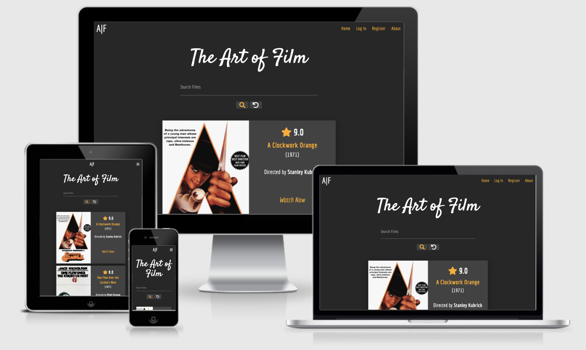</div>

---

# <div align="center">PART 1: PRE-DEVELOPMENT</div>

The first section of this README details the pre-development process. Typically, this was written during the pre-development stages and therefore refers to the project in future tense. The contents of this section are summarised below.

- Frontend Design: User Experience (UX)
    - User Stories
	- Design
	- Features

- Backend Design: Database Management System (DBMS)
    - Conceptual
    - Logical
    - Physical

## Frontend Design: User Experience (UX)

The design of the site began with target user objectives in mind and worked up from there. The process is detailed here.

### User Stories

The **primary users** of this site will fall into two overlapping categories: those wishing to learn more about the art of film, including finding and watching arty films, and those wishing to share their views about the art of film. They will want:

1. To understand what the site is about on first visit

2. To see an index of films alongside information about the artistic elements of each

3. To create an account and user profile

4. To upload their views and rate films that are already on the site

5. To add films to the site to share with other users

6. To find films related to their favourite films

7. To find where to watch any of these films

**Return visitors** will want very much the same, as this process is ongoing.

The **site owner** will want to:

1. Invoke a deeper understanding and appreciate for the art dimension of film

2. Earn affiliate revenue via links to streaming platforms

### Design

#### - Strategy -

The **strategy** of the website must align with the user goals above.

The **primary goal** of this website is to present to the user an index of films with ratings and reviews regarding the artistic element of the films.

The **secondary goal** of this website is to allow users to create a profile, and then add films and reviews to the index themselves.

The **tertiary goal** of this website is to funnel users to streaming sites where they can watch the films, in doing so earning a revenue for the site owner to sustain the site

#### - Scope -

The scope of the website is to achieve the strategic goals outlined above.

The main scope considerations are:

- The landing page will display to our target users what this site is via a title, a catchy graphic and a tag line

- The landing page will also be home to the main index so that both registered users (members) and non-registered users can view the index

- The landing page will allow users to log in to the member’s area, which will contain:

    - Their profile details

    - Their personal favourites

    - Films they’ve uploaded

- There will be functionality to create, read, edit and delete:

    - Their personal details

    - Films

    - Ratings/reviews on films

- Each film will have five metrics that will be used to add depth to the ratings:

    - Aesthetic (i.e., set design, costumes, colour palette)

    - Sound (i.e., music, effects, ambient noise)

    - Dialogue (i.e., flow, poignancy, poeticism)

    - Objective Meaning (i.e., symbolism, validity, impact)

    - Subjective Meaning (i.e., emotive response, gut feeling, opinion)

The content considerations are:

- The index will contain text and a graphic for each film

- Ratings will be displayed in an aesthetically appealing way

- Input fields will be used for user reviews and adding entries

- Icons will be used where appropriate for symbolic assistance and aesthetic

#### - Structure -

The structure of the website must accommodate both members and non-members. As such, certain elements will only display to members once they log in. Still, since the site revolves around a central index, the structure will be relatively simple.

The **website structure** will be as follows, with pages 5-10 as members only content:

1. Landing Page (Hereon Index): including,

    - A title pertaining to what the website is

    - The main index

    - A link to the login page

    - An option to add films (members only)

2. _Film Page_: each film can be displayed on its own page with all the reviews for that film and the options to add a review (for members only)

    - This will be a single page for all films but populated using the database

3. _About Page_: there will be an about page with details on how to contact the site owner

4. _Login/Register Page:_ a basic login page to the member’s area with option to register for new users

5. _Member’s Area_: a page showing the user’s profile, their reviews and films to date, options to edit all of these, and an option to add a film

6. _Add Film_: a page allowing members to upload a

7. _User Page_: users can click on member names and view their profiles which allows members with the same taste to find similar films

    - This will be a single page for all films but populated using the database

8. _Add Review_: an input form page so users can add a review to any film

9. _Edit Review_: a page allowing users to update the information within their review or to delete their review

10. _Edit Film_: a page allowing users to update the film information for their own films, or delete their own films provided there are no other reviews on the film

A visual representation of this is below in the site diagram:

<div align="center">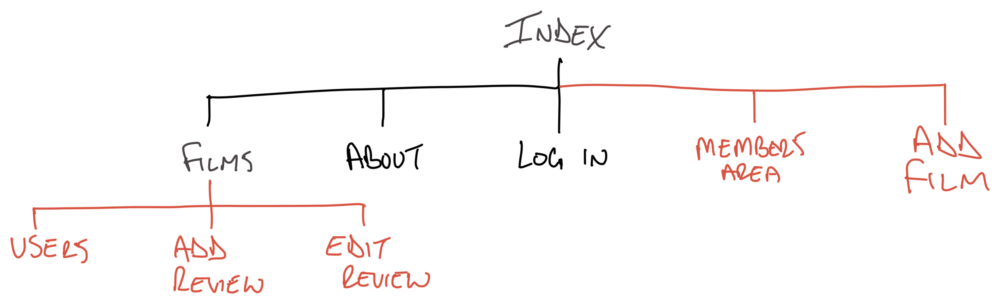</div>

**Information flow** for the website is relatively straightforward. The main index is the centrepiece, the main trunk if you will. From this, individual films are the branches leading off the tree, and the users that added these films are like leaves sprouting from these branches. Of course, in this metaphor, you can jump from one branch or leaf to another via certain links, but the intention is that the main index is the place users will always return.

**Navigation** for the website is via top bar navigation that will collapse to a right-hand side bar on smaller screens. The footer will contain some basic information regarding the site, such as copyright information and social media links.

**Interaction** is limited to the CRUD (create, read, update and delete) pages for users to interact with this main central tree, since the emphasis here is on database management.

#### - Skeleton -

Initial sketches on paper led to the following basic wireframes being developed using Concept App on an iPad Pro.

<div align="center"></div>

As you can see, the layout is simple and consistent on each page. A breakdown of the **features** are as follows:

1. Index:
 - Title and tag line to show users what the site is about
 - Film strip to separate the title from the index and to set the layout for the site
 - A search box for users to search for a film
 - The film index, ranked based on ‘overall score’ and including summary details for each film

2. Film Page:
 - The film’s title, followed by the regular film strip separator
 - A summary of the film
 - A breakdown of the film’s individual scores against the five metrics
 - Reviews of the film by different users, ranked chronologically

3. About Page:
 - The title of the page, followed by the regular film strip separator
 - Information about the site

4. Login/Register Page:
 - The title of the page, followed by the regular film strip separator
 - A form for logging in
 - An alternative form for new users to register

5. Member’s Area:
 - The title of the page, followed by the regular film strip separator
 - The member’s profile
 - The member’s uploaded films
 - The member’s uploaded reviews
 - A button to log out

6. Add Film:
 - The title of the page, followed by the regular film strip separator
 - A form to capture the details of the film to be added

7. User Page:
 - The title of the page, followed by the regular film strip separator
 - The profile of the user
 - Films the user has added
 - Reviews the user has added

8. Add Review:
 - The title of the page, followed by the regular film strip separator
 - The name of the film, the film image, and its current overall rating
 - A form to capture the review details, including boxes for each metric
 - A button to submit the review

9. Edit Review:
 - The title of the page, followed by the regular film strip separator
 - The name of the film, the film image, and its current overall rating
 - A form to capture the revised review details, including boxes for each metric
 - A button to submit the revised review
 - A button to delete the review entirely

10. Edit Film:
 - The title of the page, followed by the regular film strip separator
 - A form to capture the revised details of the film
 - A button to submit the revised film details
 - A button to delete the film entirely

#### - Surface -

Following the wireframes, the final step of design was to create in-depth [**mockups](** **https://www.figma.com/file/UTkeK2se196EizOpaeBEu6/Untitled?node-id=10%3A0)**. Due to time constraints, four different pages were created that showcase the style instead of all ten. These were done using a mobile-first approach and will be scaled up during development. They were created using Figma, and screenshots of these are below

<div align="center">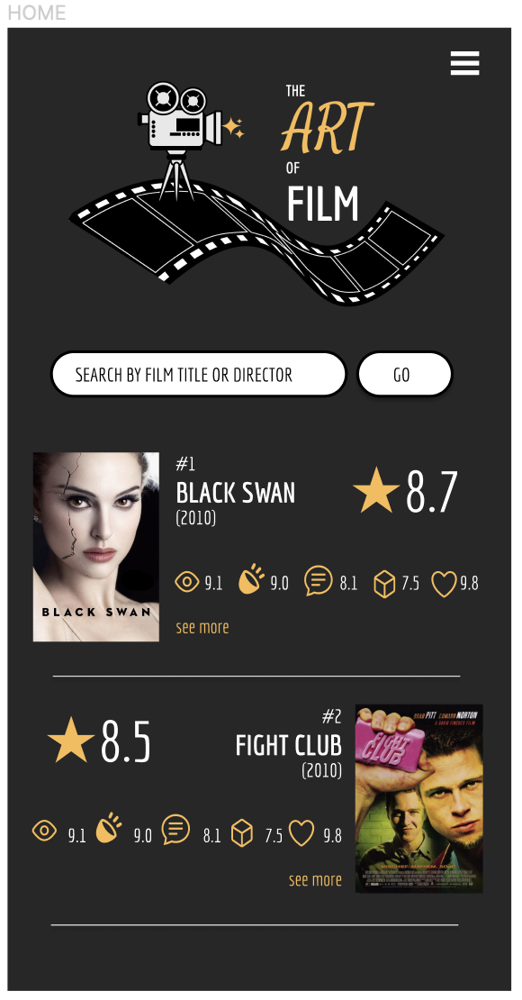</div>

<div align="center">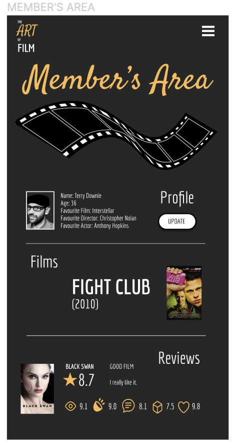</div>

<div align="center"></div>

<div align="center"></div>

Regarding **typography**, [Economica](https://fonts.google.com/specimen/Economica#about) and [Satisfy](https://fonts.google.com/specimen/Satisfy#about) have been chosen.

Economica was designed for inkjet printers and publishing, so that the font retains legibility even in small spaces, allowing this clean, non-typical sans serif font to be used for almost all the text on the site without a hint of readability issues. This in turn allows for the accent font Satisy, a brush script font that is quite artsy, to be used very sparingly. This combination symbolises the idea of the site: to find films that are well made with a touch of art.

The **colour scheme** employed is grey, white, and gold. Originally, the wireframes had the site with a white background, however gold is a suitable choice for a film-oriented site, and the web accessibility contrast checker made it clear a white background would clash heavily with gold. This way, the white text on dark grey is clean and clear and quite stylish, and the gold is a suitable accent colour.

**Imagery** is used here in four instances: the film strip, used on the logo and separating titles from the main body in other pages; film posters, to show the films visually; user profiles, for adding personalisation; and icons, utilising the metaphorical nature of the human mind.

The **copy** used is quite minimalistic, with the exception of the About page, which explains the purpose of the site and how to use it. Once that has been explained, the rest of the copy is almost exclusively entered by users in the form of film details or review details.

#### - Features -

##### Main Index

On the Index page, the main index will display the films in ranked order based on the overall score. All users can scroll this main index and search for films.

##### Search Bar

On the top of the Index page, there is a search bar where all users can search films based on their title or director.

##### View Individual Film & Reviews

All users can click on any film in the index, which opens up the film page for that film containing more info as well as all the reviews for that film and who posted each review.

##### Log In/Register

Users can log in to the site, taking them to the Member’s Area, and allowing the additional features below. New users can register on the same page.

##### View User Profile

Members can click on any review’s author and view the author’s profile, including their favourite films and the films they’ve added and reviewed.

##### View Own Profile

Members can view and edit their own profile, adding details about their favourite film, and can see all their added films and reviews in one place.

##### Add Film

Members can add films to the index, can edit films they’ve added, and can delete films they’ve added provided there are no other reviews on the film.

##### Add Review

Members can add reviews to films and edit/delete their existing reviews. Overall scores are automatically calculated based on the five metrics.

## Backend Design: DBMS

The relational database design process is laid out here.

### Conceptual

Initially, an Entity Relational (ER) data model was developed, as shown below.

<div align="center">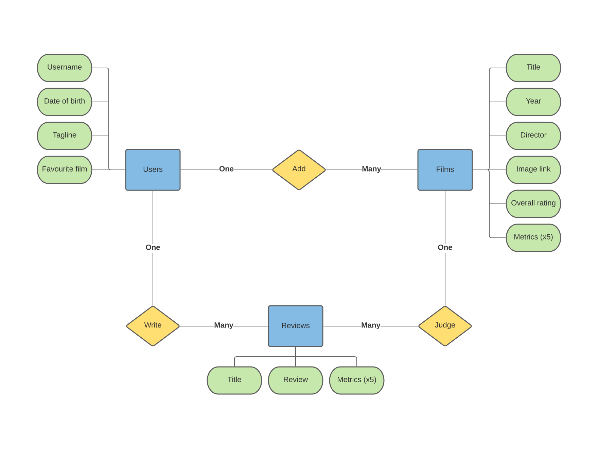</div>

Here, the blue squares represent the three main entities: users, films, and reviews. The yellow diamonds represent the relationships between the entities, with the relational verb within the diamond and the cardinality labelled on the lines that connect each entity pair. Finally, the green ovals represent the attributes of each entity; for brevity, I’ve used one oval for the five metrics, though these are in fact five separate attributes.

### Logical

Next, a database schema was developed that shows the data types for each of our attributes, as well as how foreign keys will link each entity. This was based on the above ER data model and shown below.

<div align="center">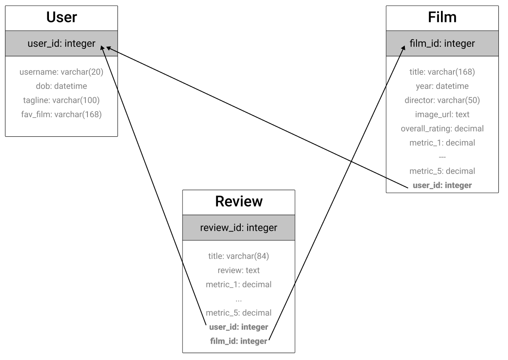</div>

As you can see, integer, decimal, datetime, text, and various varchar length data types were chosen as the most suitable data types for the attributes in question, with the varchar lengths chosen to be reasonable, but also to limit excessive input. ObjectID is a BSON type which is used for unique identifiers by default in DBMS like MongoDB. The longest film title in the world is 168 characters, hence the limit on film title; half of this was chosen for the review title since a review can never equal a film.

### Physical

The final step in the database design process was to determine the specific DBMS to be used, alongside incidental factors such as whether to use additional indexes and where to store the database.

The two database options are relational and document oriented. In this instance, the data is clearly structured, however, the project requirements are that MongoDB and Flask be utilised, and based on the schema and the relationships between pieces of data, this combination works nicely. In addition, Heroku will be used to host the application.

Regarding indexes, it makes sense for users to be able to search films based on the film title and the film’s director. As such, at this stage, it is postulated that adding an index to each of these attributes would improve data read times.

---
# <div align="center">PART 2: DEVELOPMENT</div>

The second section of this README details the development process. This was written incrementally after each stage of development, therefore outlining the full process of development. This means much of the code and even the comments are likely to differ from the finished article due to incremental changes. The contents of this section are summarised below.

- Phase I: Environment
    - Setting up the MongoDB Database
    - Creating the Flask Application
    - Deploying the App to Heroku
    - Connecting Flask to MongoDB
    - Setting up the Base Template
    - Adding Frameworks & Libraries
- Phase II: Functionality
    - Navbar
    - User Authentication
    - Film Functionality
    - Review Functionality
    - Core Features
- Phase III: Styling
    - Layout
    - Palette
    - Typography
    - Imagery
    - Streamlining CSS
- Phase IV: Responsiveness
- Phase V: Accessibility
    - Mark-up
    - Visual Appearance & Content
    - Dynamic Content
    - Images & Multimedia
    - Forms
- Technology Used
    - Languages
    - Database, Frameworks, Libraries & Tools

## Phase I: Environment
The first phase of development was to set the environment. This foundational step ensured that all the tools were integrated, and dependencies properly added.

### Setting up the MongoDB Database
As is best practice, the first step was to create the MongoDB database.

I already had a cluster set up from a previous project, so an additional database was added to this cluster named, in customary camelCase, theArtOfFilm.

Following this, I created three collections with this database: films, reviews, and users.

Finally, I manually added test documents into the film and user collections. In the users section, I added myself; in the film collection, I added Black Swan and Fight Club as per my mock-ups. These can be seen in the image below, taken from MongoDB.

<div align="center">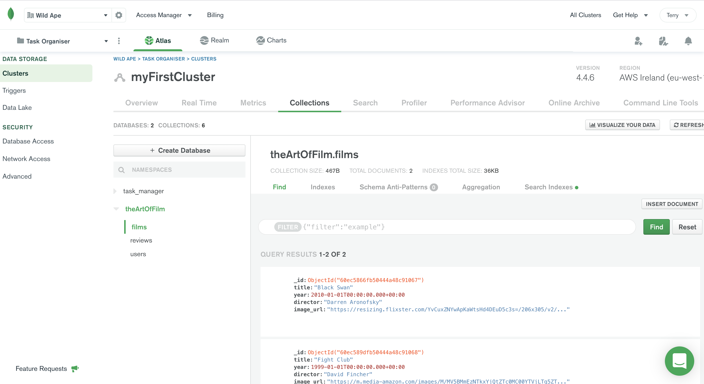</div>

### Creating the Flask Application
The next step was to create the Flask application.

To do this, I first set up my development environment using the Code Institute’s [GitPod template](https://github.com/Code-Institute-Org/gitpod-full-template) and opened this within GitPod via GitHub.

Once inside the development area, I installed Flask using the terminal using the command below:

```cli
pip3 install Flask
```

Then, using the command line’s ‘touch’ feature, I created the following python files:
- env.py
- app.py

Then, within the env.py file, I imported the operating system.

```python
import os
```

Next, still within the env.py file, I set up my default environment variables. These are detailed below, however the SECRET_KEY has been replaced with a series of asterisks for security reasons. [Randomkeygen](https://randomkeygen.com/) was used to generate the SECRET_KEY, and the MONGO_URI variable was added at a slightly later point once the rest of the Flask application had been set up. 

```python
os.environ.setdefault("IP", "0.0.0.0")
os.environ.setdefault("PORT", "5000")
os.environ.setdefault("SECRET_KEY", "*****")
os.environ.setdefault("MONGO_URI", "")
os.environ.setdefault("MONGO_DBNAME", "theArtOfFilm")
```

Within the app.py file, I performed a series of steps so that the app would function.

First, I added the Flask module.

```python
import os
from flask import Flask
```

Second, I told the application to import the env package provided it can find the file within the operating system. Since the env.py file is not pushed to GitHub for security reasons, as it contains information that allows access to the database, Heroku will be unable to find the file in GitHub once deployed. 

```python
if os.path.exists("env.py"):
    import env
```

Third, I created the Flask app.

```python
app = Flask(__name__)
```

Fourth, I added a typical ‘hello world’ application to confirm the app was functioning.

```python
@app.route("/")
def hello_world():
    return "Hello World!"
```

Fifth, I told the app how and where to run the application by retrieving the IP/PORT information from the env.py file. Additionally, I set the application so that errors are displayed with details attached. This will be changed to debug=False before launching and submitting the project.

```python
if __name__ == "__main__":
    app.run(host=os.environ.get("IP"),
            port=int(os.environ.get("PORT")),
            debug=True)
```

Finally, I ran the app.py file from the terminal and opened the result in a browser tab to show that the app was functioning correctly.

### Deploying the App to Heroku
The next step in setting the environment was to deploy the app to Heroku for hosting. Before deploying the app to Heroku, however, there were several files I needed to create using the CLI in my GitPod environment.

First, using the CLI, I created a requirements.txt file that tells Heroku which applications and dependencies are required to run the app.

```cli
pip3 freeze --local > requirements.txt
```

Then, I created the Procfile, a file that tells Heroku how to run the app and which file runs it.

```cli
echo web:  python app.py > Procfile
```

Once these files were set up, I logged in to my Heroku account and created a new app called ‘the-art-of-film’ which I chose to locate in Europe. I then connected the app to the GitHub repository using Heroku’s in-built connectivity. Finally, I configured the variables in Heroku to match those I set up within the env.py file earlier, as below.

<div align="center">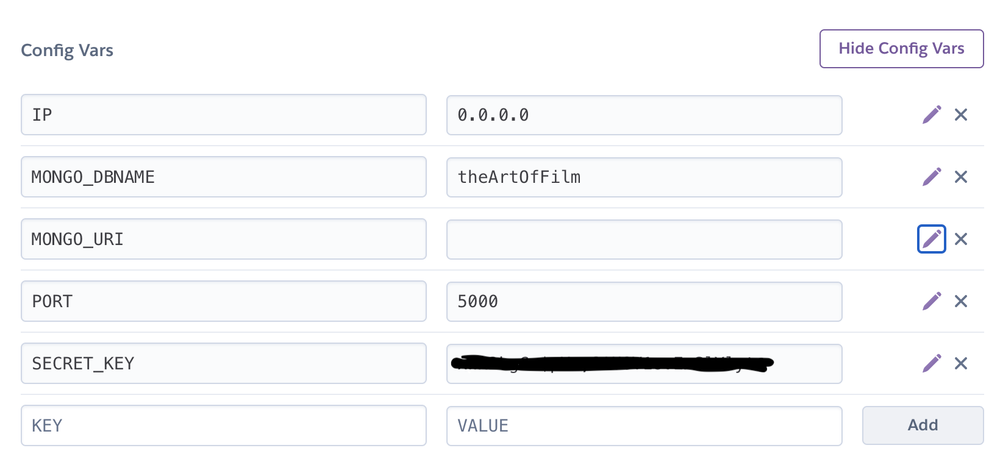</div>

Finally, I used Heroku’s in-built functionality to enable automatic deployment and to deploy the main branch directly from GitHub.

<div align="center">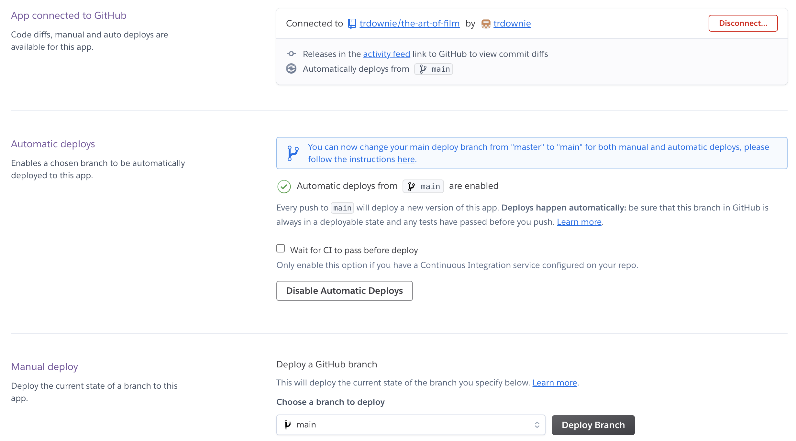</div>

### Connecting Flask to MongoDB
Once the Flask application was connected to Heroku hosting, the next step was to connect the Flask app to the MongoDB database. The following steps outline this process.

First, using the CLI, I downloaded flask-pymongo, a third-party library that allows communication between Flask and MongoDB.

```cli
pip3 install flask-pymongo
```

Then, I installed dnspython, a package that enables the MongoDB SRV connection string.

```cli
pip3 install dnspython
```

Since these steps added new packages to the Flask application, the next step was to update the requirements.txt file.

```cli
pip3 freeze --local > requirements.txt
```

Next, within the app.py file, I added some imports from the packages I had just installed. Specifically, I installed PyMongo, to communicate with MongoDB, and ObjectID, to allow rendering of BSON documents from MongoDB.

```python
from flask_pymongo import PyMongo
from bson.objectid import ObjectId
```

After the imports, the next step was configuration. This involved three parts: obtaining the database name, for obvious reasons; configuring the connection string, called the MONGO_URI; and obtaining the SECRET_KEY, a requirement for certain Flask functions.

```python
app.config["MONGO_DBNAME"] = os.environ.get("MONGO_DBNAME")
app.config["MONGO_URI"] = os.environ.get("MONGO_URI")
app.secret_key = os.environ.get("SECRET_KEY")
```

Since the MONGO_URI connection string still hadn’t been added to the env.py file, this was the next step. To do this, I logged in to MongoDB, navigated to my cluster, then clicked: overview > connect > connect your application. This provided me the connection string, as below.

<div align="center">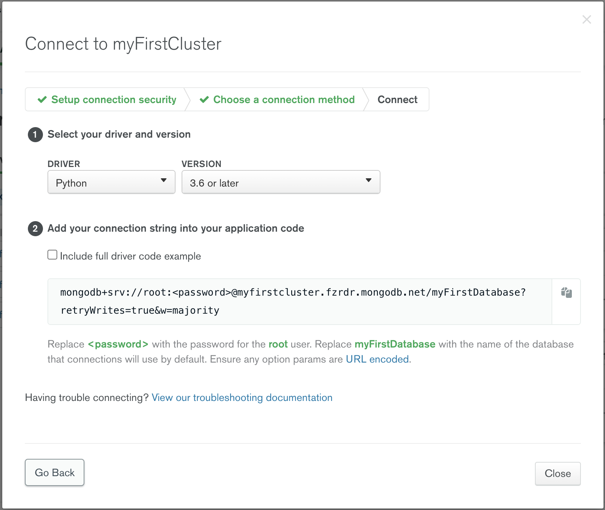</div>

Replacing the <password> and myFirstDatabase text with the password from my MongoDB root user profile and database name, respectively, I then pasted this MONGO_URI into both the env.py file and Heroku configuration variables, in the appropriate places.

```python
os.environ.setdefault("MONGO_URI", "")
```

Following this, I defined an instance of PyMongo within the app.py file using the constructor method. This uses an instance of the Flask app, created earlier, to create an instance of mongo, which allows for communication via the PyMongo package to the MongoDB database.

```python
mongo = PyMongo(app)
```

At this point, the Flask app, MongoDB database and Heroku hosting were all properly connected. Before moving on, however, I needed to add a few more imports that would ensure this connection had the functionality required to build the app.

 ```python
from flask import (
    Flask, flash, render_template, redirect, request, session, url_for)
``` 

Before moving on, it made sense to test the connection between Flask and MongoDB. So, I replaced my ‘Hello World’ function from earlier with a function that would render the test films within my films collection on the index page of the app (something I would need anyway!).

This function is shown below. The first line is the default root, so that this page is the default landing page. The second line attaches ‘/index’ to an @app.route decorator so that the Flask app redirects to this function when attached to a URL. The third line defines the function itself, also called ‘index’ to match the root. The fourth line defines a variable ‘films’ that contains all documents from the films collection. Finally, the fifth line renders the index.html template, as well as passing a second ‘films’ variable for use within the template.

```python
@app.route("/")
@app.route("/index")
def index():
    films = mongo.db.films.find()
    return render_template("index.html", films=films)
```

Since Flask looks for all HTML template files within a directory at the root-level called ‘templates’, creating this, alongside the index.html template, was the next logical step. I done this using the CLI.

```cli
mkdir templates
touch templates/index.html
```

Finally, to test the connection, I needed to add some code to my index.html file that told the app what to display on the screen. To do this, I set up a standard boilerplate followed by a for loop using the Jinja templating language that would display the title, year, director, and image URL for each film, with basic formatting breaks.

```HTML
    
        {{ film.title }}<br>
        {{ film.year }}<br>
        {{ film.director }}<br>
        {{ film.image_url }}<br><br>
    
```

Now, by launching the app via the CLI in GitPod or via Heroku, my films collection was rendered as desired, confirming the connection.

<div align="center">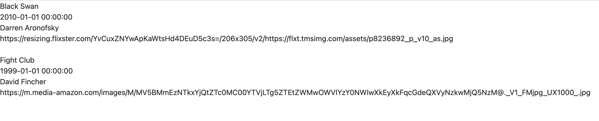</div>

### Setting up the Base Template
Since Jinja will be used, to save time and help abide by the DRY (don’t repeat yourself) principle, the next step was to set up a base template.

To do this, a base.html file, complete with boilerplate and semantic markup, was added to the template directory, and the following Jinja code was utilised at the appropriate place.

```HTML
    

    
```

Then, within the index, the boilerplate and semantic markup was deleted and replaced with the corresponding Jinja block content.

```HTML



    
        {{ film.title }}<br>
        {{ film.year }}<br>
        {{ film.director }}<br>
        {{ film.image_url }}<br><br>
    


```

This combination rendered the same result, however now the app was now displaying the base template injected with the logic of the index template. This sets the scene for later development that will build on the base template as much as possible to avoid repetition.

### Adding Frameworks & Libraries
Good programming leverages frameworks and libraries to speed up development and add functionality that would otherwise be laborious. As such, the final step in setting the environment up was to add any required frameworks and libraries.

The following frameworks and libraries were added using the appropriate semantic markup:
•	Materialize, a CSS framework
•	JQuery, a JavaScript library
•	Font Awesome, an icon library

In addition, custom CSS and JavaScript files were set up within a static directory. These will contain any custom code alongside any JQuery elements copied from Materialize for functionality of its elements. To link these custom files to the base template, Jinja markup was required so that the app could locate the proper files. The JS code for this is below. 

```HTML
    <script src="{{ url_for('static', filename='js/script.js') }}"></script>
```

Finally, Jinja blocks were added to the base template for any styles and scripts that might only be used within child templates. The JS code for this is below.

```HTML
    
    
```

Restarting the Environment
Since the env.py file isn’t pushed to GitHub, each time the environment is restarted it needs to be added once more. In addition, any installed packages require re-installation. These two steps are displayed below.

```cli
pip3 install Flask
pip3 install dnspython
pip3 install flask-pymongo
touch env.py
```

```python
import os

os.environ.setdefault("IP", "0.0.0.0")
os.environ.setdefault("PORT", "5000")
os.environ.setdefault("SECRET_KEY", **************)
os.environ.setdefault("MONGO_URI", **************)
os.environ.setdefault("MONGO_DBNAME", "theArtOfFilm")
```
	
## Phase II: Functionality
The second and main phase of development was to add all the basic features and functionality that were outlined in the design section. During this phase, some basic styling was added to support functionality/testing, however, more comprehensive styling that enhances the aesthetic is outlined in the subsequent phase.

To ensure this document retains some element of concision, emphasis is placed on backend development. As such, the steps taken regarding backend development are broken down into granular detail with associated code snippets, however, the steps regarding frontend development are summarized more briefly. In addition, these steps were written in real-time, therefore, due to refactoring, the final piece may differ slightly in syntax, but it should be accurate in function.

To see the full finished code, please see the [GitHub repository](https://github.com/trdownie/the-art-of-film).

### Navbar
It made practical sense to begin development with the Navbar. For this, I leveraged the ease and simplicity Materialize has to offer and selected their mobile collapse navbar.

To ensure this element worked well with the grey and white of the site, the body of the site and the menu bar was styled using a combination of custom CSS and Materialize classes; specifically, the “transparent” colour class, to remove the background colour, and the “z-depth-0” class, to remove the shadow. In addition, the collapse icon was changed to the Font Awesome hamburger icon, the collapse functionality JQuery was tailored to ensure the menu opens on the right as is common, and the links were changed to match those required for the site.

<div align="center">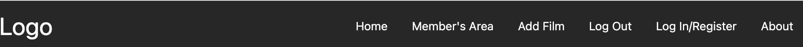</div>

<div align="center"></div>

<div align="center">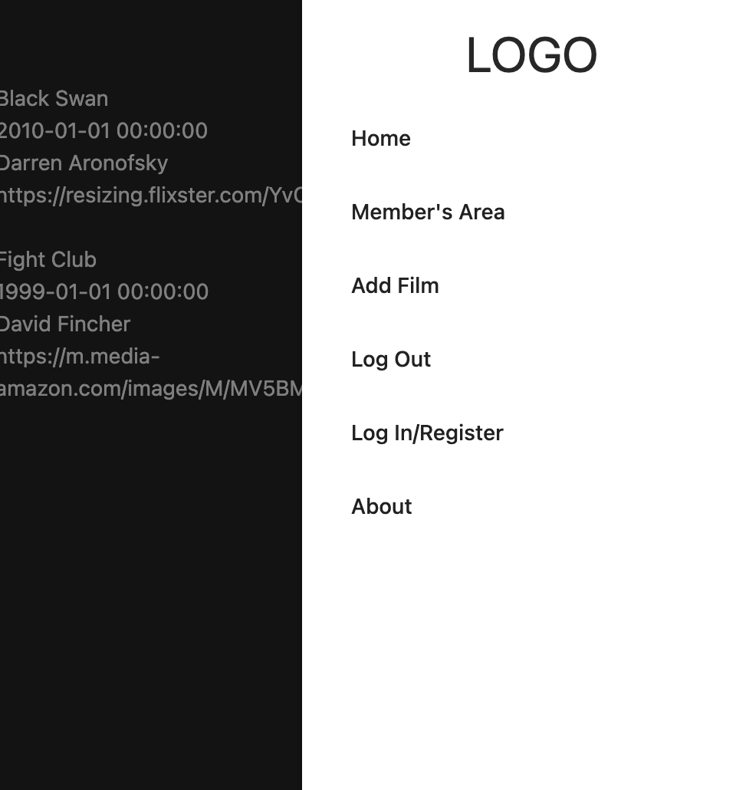</div>

In addition, the Home link and the main logo were connected to the homepage using Jinja notation, as shown below. For the sake of brevity (dare I say!) this logic will not be shown again, though it will be used throughout development.

```HTML
<li><a href="{{ url_for('index') }}">Home</a></li>
```

### User Authentication
User authentication was the next step in development. This involved creating the register and login functionality, the Member’s Area, which is the landing page for users after logging in, and the logout functionality.

#### - Registering -
Importing security features
The first step in creating a registration form was to consider security. Luckily, Flask comes with inbuilt security features via Werkzeug, which were imported via the app.py file.

```python
from werkzeug.security import generate_password_hash, check_password_hash
```

##### Creating the template
Next, I created a register.html file that extends the base template in the same way as the index.html file. Within the block content, I added a Materialize card and tailored the card to ensure it met my requirements. Within this card, I then added Materialize form elements with icons that relate to a basic registration form with fields for username and password and a submit button. Finally, I attached the POST method to the form and set the action to the register function using the Jinja ‘url_for’ notation.

<div align="center">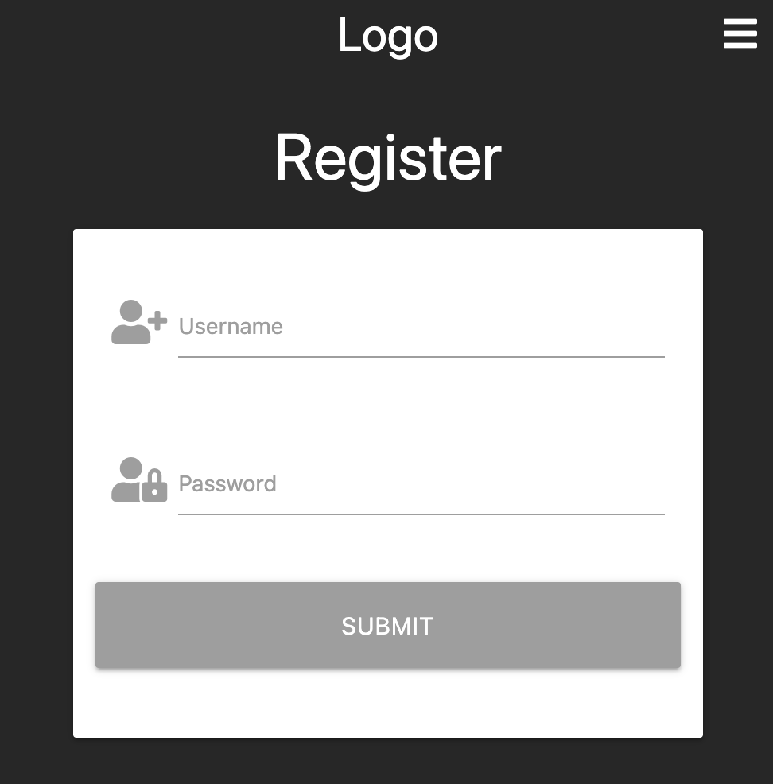</div>
 
##### Adding functionality
Once the basics were in place, it was time to create the register view function within the app.py file. The code for the function is below, with detailed, self-explanatory commentary (DRY).

```python
@app.route("/register", methods=["GET", "POST"])
def register():
    if request.method == "POST":
        # 1) CHECK WHETHER USERNAME EXISTS IN THE DB
        # a) define existing_user variable
        # b) get the (lowercase) username from the form
        # c) search 'users' collection to find first instance of username
        # d) if username found, assign it to existing_user
        # e) else existing_user undefined
        existing_user = mongo.db.users.find_one(
            {"username": request.form.get("username").lower()})

        # 2) USERNAME ALREADY EXISTS
        # a) if existing_user = Truthy (has a value)
        if existing_user:
            # i) return error message
            flash(request.form.get("username")
                 + " already exists. Nice try, replicant.")
            # ii) redirect to registration page
            return redirect(url_for("register"))

        # 3) USERNAME DOESN'T EXIST
        else:
            # a) create a dictionary containing the user info
            register = {
                "username": request.form.get("username").lower(),
                "password": generate_password_hash(request.form.get("password"))
            }
            # b) insert the dictionary into the users collection
            mongo.db.users.insert_one(register)

            # c) add the newly created user into the session cookie
            session["member"] = request.form.get("username").lower()
            # d) display registration success message
            flash("Registration successful, "
                    + request.form.get("username") 
                    + ". Welcome, human.")

    return render_template("register.html")

```

At this point, there were flash messages being created without being displayed anywhere. So, the next step was to add a section within my base template that would display these at the top of the screen whenever they were triggered.

	
```html
    <section>
        <!-- display flash messages -->
        
            
                
                    <div class="row s6">
                        <h4 class="white-text center-align">{{ message }}</h4>
                    </div>
                
            
        
    </section>
```
	
Finally, I set the minlength and maxlength attributes for the username (3, 20) and password (8, 20) and used the pattern attribute to set a basic RegEx for both to only allow lowercase and uppercase letters and numbers.

```python
pattern="^[a-zA-Z0-9]{8,20}$"
```

#### - Logging In -
##### Creating the template
First, I copied the register.html template to create a login.html file that extends the base template and updated the form accordingly.

##### Adding functionality
Next, I created the login view function within the app.py file. The comments within the code explain the functionality. The Werkzeug check_password_hash feature comes in handy here to determine whether the submitted password, once hashed, matches the original hash of the user from when they registered. Redirects were used in the event of errors so that the page fully reloads, thus erasing the previously submitted form contents. At this point, logging in doesn’t actually do anything, so once the member’s area is set up, upon logging in, the member will be directed to the member’s area.

```python
@app.route("/login", methods=["GET", "POST"])
def login():
    if request.method == "POST":
        # 1) CHECK WHETHER USERNAME EXISTS (AS ABOVE)
        # (if found, existing_username is assigned user's document)
        existing_user = mongo.db.users.find_one(
            {"username": request.form.get("username").lower()})

        # 2) USERNAME EXISTS - CHECK PASSWORD
        if existing_user:
            # a) hashed passwords match (input/db)
            if check_password_hash(
                    existing_user["password"], request.form.get("password")):
                        # i) set session 'member'
                        session["member"] = request.form.get("username").lower()
            # b) passwords don't match
            else:
                # i) return incorrect flash message
                flash("Username and/or password incorrect."
                         + " Thought Police dispatched.")                
                # ii) reload login page
                return redirect(url_for("login"))

        # 3) USERNAME DOESN'T EXIST
        else:
            # a) return incorrect flash message
            flash("Username and/or password incorrect."
                    + " Thought Police dispatched.")
            # b) reload login page
            return redirect(url_for("login"))

    return render_template("login.html")
```

#### - Member’s Area -
Creating the template
Continuing with the same process, I copied the index.html template to create the members.html template and added only a very basic template to ensure the connection had been made. The member variable used here is defined in the following section.

```html


<h1 class="center-align">Member's Area</h1>

<h2 class="center-align">{{ member }}</h2>

```

##### Adding functionality
Next, I created the members view function. Here, the root directory is based on the member variable passed in by the base template when called (see following code snipped), specifically set as the session[‘member’], which has just been set by the user logging in or registering. Then, the function defines a new member variable as the member’s username. Following this, provided the user is correctly logged in (if statement), the members.html template is rendered and passed the new member variable for use in the Jinja logic (seen above). Otherwise (else statement), the user will be redirected to login, which is a security feature to prevent a member being able to bypass the login page and jump straight to a member’s page using a URL, since no session variable will exist.

```python
@app.route("/members/<member>", methods=["GET", "POST"])
def members(member):
    # 1) DEFINE THE MEMBER VARIABLE
    # a) take the session["member"] and find its instance in the db
    # b) since this will return doc, only return the ["username"] attribute
    member = mongo.db.users.find_one(
        {"username": session["member"]})["username"]
    # 2) IF LOGGED IN, RENDER MEMBERS TEMPLATE
    #    & PASS IT MEMBER VARIABLE
    if session["member"]:
        return render_template("members.html", member=member)

    # 3) IF NOT LOGGED IN RETURN USER TO LOGIN PAGE
    else:
        return redirect(url_for("login"))
```

This Jinja code calls the members view function and passes it the session[‘member’], and was added to the base template navigation bar for navigation to the correct member’s area.

```html
"{{ url_for('members', member=session['member']) }}"
```

##### Extending the logic
Finally, I added a redirect to both the login and registration pages so that upon successful login or registration, the member is redirected to the member’s area. Again, the newly set session variable was passed into the members view function to ensure functionality is consistent as above.

```python
return redirect(url_for("members", member=session["member"]))
```

Note: at this point, the member’s area is basic and only contains the member’s name, however this is expanded upon later.

#### - Logging Out -
Adding functionality
Logging out is achieved via the navbar, therefore no template was required. The logic is quite simple:

1.	A new variable is defined with local scope so that the cookie can be deleted.
2.	The ‘member’ session cookie is what determines whether the user is logged in or not, so to effectively log them out, I used clear() to clear all cookies.
3.	A personalised flash message is displayed.
4.	The user is redirected to the main index page where the flash message will be displayed.

```python
@app.route("/logout")
def logout():
    # 1) DEFINE NEW VARIABLE MEMBER
    member = session["member"]
    # 2) REMOVE THE SESSION COOKIE
    session.clear()
    # 3) DISPLAY PERSONAL MESSAGE CONFIRMING LOG OUT
    flash("May the force be with you, " + member + ".")
    # 4) REDIRECT USER TO LOGIN PAGE
    return redirect(url_for("index"))
```

##### Updating the navbar
The final step in user authentication was to tailor the navbar so that only the appropriate links are displayed, depending on whether a user is logged in or not. To achieve this, Jinja templating was used that refers to the session ‘member’ cookie to determine which links to display. The index and about pages are left out of the loop since they are displayed to all users, but should remain first and last, respectively.

```python
<li><a href="{{ url_for('index') }}">Home</a></li>

<li><a href="{{ url_for('members', member=session['member']) }}">Member's Area</a></li>
<li><a href="sass.html">Add Film</a></li>
<li><a href="{{ url_for('logout') }}">Log Out</a></li>

<li><a href="{{ url_for('login') }}">Log In</a></li>
<li><a href="{{ url_for('register') }}">Register</a></li>

<li><a href="sass.html">About</a></li>
```

### Film Functionality
After user authentication, the next logical step was to build out the CRUD functionality for members to be able to create, read, edit, and delete films.

#### - Add Film (Create) –
##### Creating the template
An add_film.html template was created that extends the base template in the usual way via block content, and this was linked back to the base template using Jinja templating within the navbar. On the page, a header was added, and several materialize elements were pieced together to create and style (in a limited, incomplete way) an input form for adding films to the database. This input form was given the “POST” method, since it will submit data to the database, and the action was linked to the add_film view function that was subsequently created (see below).

At this stage, the form was not entirely complete as there were some extra features that would enhance the form pencilled in for later development, depending on time. The fields added were:
•	Title, a standard input field 
•	Year, a standard input field
•	Director, a standard input field
•	Synopsis, a text area input field
•	Image URL, a standard input field
•	Genre, a non-functional materialize chips element which required enhanced initialization beyond the scope of this phase of development
•	Member, which utilised Materialize’s disabled feature and prepopulated the input field using Jinja and the session cookie variable for the member*

*Of course, this could have been added via python on the backend without displaying anything to the user, but I feel this enhances the user experience slightly by showing the member that they will receive credit for adding the film, especially since the form requires information that warrants minor research.

##### Adding functionality
Next, in the app.py file, I created the add_film view function with the methods “GET” & “POST” since the form will be sending information to the database, and in time may be receiving information also (such as genre, or even descriptive tags, if time allows).

1.	Since submitting a form uses the ‘POST’ method, the submit action is wrapped in an IF statement that determines whether the submit button was clicked
a.	First, a dictionary is created that contains all form elements
i.	Since the member form field is disabled, meaning on submit the form doesn’t register that it exists, I used the session cookie to set this key-value pair on the back end before adding this dictionary to the film collection
b.	Second, this newly created dictionary is sent to the films collection in the DB
c.	Third, a message is displayed thanking the member
d.	Fourth, the member is returned to the member’s area
2.	If the post method is not triggered, meaning the add_film view function is called in any other form than via the form’s submit button, such as via the main navigation, then the template is rendered as standard since the if method is not True

```python
@app.route("/add_film", methods=["GET", "POST"])
def add_film():
    # 1) UPON SUBMIT (POST) ADD THE FILM & DISPLAY MESSAGE
    if request.method == "POST":
        # a) create film dict. that contains form elments
        film = {
            "title": request.form.get("title"),
            "year": request.form.get("year"),
            "director": request.form.get("director"),
            "synopsis": request.form.get("synopsis"),
            "image_url": request.form.get("image_url"),
            # i) member form field is disabled so we must set it here
            "member": session["member"]
        }
        # b) insert film dict. into mongodb films collection
        mongo.db.films.insert_one(film)
        # c) display message thanking user
        flash("I have always depended on the kindness of strangers. Film added!")
        # d) return the user to the member's area
        return redirect(url_for("members", member=session["member"]))
    
    # 2) DEFAULT VIEW ACTION - RENDER TEMPLATE
    return render_template("add_film.html")
```

Following this, the final step was to link from the main index to the specific film page somehow. To do this, and showcasing the power of the Jinja and HTML duo, only one line of code was needed. This line, the anchor tag, was able to piggyback on the previously created for loop on the index page and create a link that passed the film view function the unique identifier from the MongoDB database that is used above.

```html
    
        {{ film._id }}<br>
        {{ film.title }}<br>
        {{ film.year }}<br>
        {{ film.director }}<br>
        {{ film.image_url }}<br><br>
        <a href="{{ url_for('film', film_id=film._id) }}">See more</a>
    
```

#### - Film Pages (Read) -
##### Creating the template
Once more, the first step was to create the film.html template that extends the base template using Jinja. Since there was overlapping logic, I copied the index.html template, and extended the code somewhat.

1.	First, I leveraged Jinja’s HTML compatibility to create the title based on the film
2.	Second, I created a ‘Summary’ section and used Jinja to add the film’s synopsis
3.	Third, I created the ‘Details’ section using the copied logic from the index.html template
4.	Fourth, I added a ‘Reviews’ section that was yet to be populated
5.	Finally, I added some basic dividers for clarity

```html



    <!---------- MAIN HEADING ----------->
    <h1 class="center-align">{{ film.title }}</h1>
    <!---------- SUMMARY SECTION ----------->
    <h2 class="center-align">Summary</h2>
    {{ film.synopsis }}<br><br>
    <hr class="rounded">
    <!---------- DETAILS SECTION ----------->
    <h2 class="center-align">Details</h2>
    {{ film.title }}<br>
    {{ film.year }}<br>
    {{ film.director }}<br>
    {{ film.image_url }}<br><br>
    <hr class="rounded">
    <!---------- REVIEWS SECTION ----------->
    <h2 class="center-align">Reviews</h2>


```

##### Adding functionality
In the app.py file, I then created the film view function to render the film template properly within its own unique root, which will use the automatically generated MongoDB ObjectId, here named <film_id>. The function takes in the ‘film_id’ variable which is equal to the MongoDB ObjectId, but at this stage not yet defined.

1.	First, it converts the film_id value, which is the raw random string MongoDB generates, and converts it into the ObjectId format that MongoDB understands, then uses this to locate the film within the database and assign this film to the newly defined variable ‘film’
2.	Second, the function renders the specific film template for this film by passing the variable film back to the template which is defined as the film document pulled from the database above

```python
@app.route("/film/<film_id>", methods=["GET", "POST"])
def film(film_id):
    # 1) LOCATE THE FILM IN THE DATABASE USING THE ID
    film = mongo.db.films.find_one(
        {"_id": ObjectId(film_id)})
    # 2) RETURN THE FILM AS AN OBJECT
    #    WHILE RENDERING THE FILM'S OWN UNIQUE PAGE
    return render_template("film.html", film=film)
```
- Edit Film (Update) -
Creating the template
I copied the add_film.html file to create an edit_film.html file, since both will mostly contain the same elements, and edited these elements to suit the new template, such as title (Edit Film) and submit button (Save). I also changed the action attribute on the form to point towards the edit_film view function that was yet to be created, passing it the film_id that will ultimately be passed into the template.

```html
action="{{ url_for('edit_film', film_id=film_id) }}"
```

##### Adding functionality
Next, I added the edit_film view function into the app.py file, whose directory is based on the film_id passed to it. There were two main requirements of this function: first, it should have the functionality to update the MongoDB document associated with the specific film in question, and second, it should render the edit_film.html form with prepopulated field so the user need only edit elements they desire.

1.	Updating the database when the edit_film.html form’s submit button is pressed (“POST”)
a.	First, an updated_film dictionary is created with the inputs from the form
b.	Second, the film in the films collection within the database is found using the film_id (that is passed into the function) and updated using the update() method
c.	Third, a film-based flash message is displayed
d.	Fourth, the user is redirected to the newly updated film page
2.	Displaying the edit_film.html template when the edit_film view is called normally
a.	A ‘film’ object (dictionary) is created containing the film details found using the film_id
b.	The edit_film.html template is rendered, with the newly created ‘film’ dictionary passed to it that will pre-populate the form

```python
@app.route("/edit_film/<film_id>", methods=["GET", "POST"])
def edit_film(film_id):
    # 1) ON SUBMIT, UPDATE FILM DETAILS
    if request.method == "POST":
        # a) create a dict. that contains the updated film details
        updated_film = {
            "title": request.form.get("title"),
            "year": request.form.get("year"),
            "director": request.form.get("director"),
            "synopsis": request.form.get("synopsis"),
            "image_url": request.form.get("image_url"),
        }
        # b) using the film's unique id, find and update this film
        mongo.db.films.update({"_id": ObjectId(film_id)}, updated_film)
        # c) display a success message (of sorts)
        flash("It's alive! It's alive!")
        # d) return the user back to the updated film page
        return redirect(url_for("film", film_id=film_id))

    # 2) DEFAULT VIEW ACTION: DISPLAY EDIT FORM TEMPLATE
    # a) create a film object that contains the film info
    film = mongo.db.films.find_one({"_id": ObjectId(film_id)})
    # b) render the page and pass the film id & film object
    return render_template("edit_film.html", film_id=film_id, film=film)
```

##### Connecting the form
Following the functionality being added, I returned to the edit_film.html template to connect the film details to the form. To do this, Jinja was used to attach the film values to the value attribute for each input field.

```html
<input value="{{ film.title }}" id="title" name="title" type="text" class="">
```

In addition, a button was added to the film.html template under the film details that pointed to the edit_film.html template, since this is the route to edit a film. The film.html page already contained the film dictionary when rendered, which was ideal for using Jinja to link to the edit_film view function and pass the function the film_id which in turn determines the file path for each film and is used on the edit_film function. This button was enclosed in a Jinja if statement so that it is only visible to those logged in, since this is a feature for members only.

```html
    
        <div class="center-align">
            <a href="{{ url_for('edit_film', film_id=film._id) }}" class="waves-effect waves-light btn grey center-align"><i class="fas fa-pen left"></i>Edit Film</a>
        </div>
    
```

Finally, a cancel button was added below the save button on the edit_film.html template that takes the user back to the film page in question if they change their mind. For this, an anchor link was used that was styled to match the ‘save’ button on the same page.

```html
href="{{ url_for('film', film_id=film_id) }}"
```

#### - Delete Film -
Extending the template
The final part of the film functionality was to provide the user with a way to delete a film. To do this, I extended the edit_film.html template so that there was a button to delete the film. Again, I used a simple anchor link but copied my styling from the ‘save’ button so that they appeared the same and added the href to trigger the delete film function.

```html
href="{{ url_for('delete_film', film_id=film_id) }}"
```

##### Adding functionality
Finally, I created the delete film view function within the app.py file. This function only needed to delete the film from the MongoDB database and return the user to the Member’s Area.

1.	Using the film_id as the ObjectId to locate the film within the database, remove the film
2.	Return a film-themed success message
3.	Render the template for the Member’s Area (this functionality is for members only)

```html
@app.route("/delete_film/<film_id>")
def delete_film(film_id):
    # 1) REMOVE THE FILM FROM THE DB COLLECTION
    mongo.db.films.remove(
        {"_id": ObjectId(film_id)})
    # 2) RETURN A FLASH MESSAGE
    flash("Hasta la vista, baby.")
    # 3) RETURN THE USER TO THE MEMBER'S AREA
    return render_template("members.html", member=session["member"])
```

### Review Functionality
The next step was to add the CRUD functionality for reviews, so users can create, read, update, and delete reviews.
#### - Add Review (Create) -
##### Creating the template
I copied the add_film.html template to create the add_review.html file since there is significant overlap in form and function. I then added a title based on the film being reviewed (using Jinja), updated the form fields so that they matched the required fields for a review, and updated the action attribute to point at the add_review URL. I also utilised Materialize’s HTML5 range elements for the five metrics so that users could interact and slide the bar to set their review scores.

##### Adding functionality
Once the template was in place, I added the add_review() view function to the app.py file. Functionality here is very similar to the add_film() function earlier described.

1.	Upon form submit (“POST”), the function adds the review to the database
a.	First, a ‘review’ dictionary is created that includes all of the submitted information from the form alongside the film_id and the member’s username
b.	Second, this dictionary is inserted into the ‘reviews’ collection on MongoDB
c.	Third, a film-themed message is displated
d.	Fourth, the user is redirected to the film page (that will eventually contain that newly added review)
2.	When the function is called otherwise, the add_review.html template is rendered
a.	A ‘film’ dictionary is defined that contains the full film document
b.	This dictionary, alongside the film_id, is passed into the add_review.html template as it is rendered

```html
@app.route("/add_review/<film_id>", methods=["GET", "POST"])
def add_review(film_id):
    # 1) UPON SUBMIT (POST) ADD THE REVIEW & DISPLAY MESSAGE
    if request.method == "POST":
        # a) create review dict. that contains form elments
        review = {
            "film_id": film_id,
            "title": request.form.get("title"),
            "review": request.form.get("review"),
            "metric-1": request.form.get("metric-1"),
            "metric-2": request.form.get("metric-2"),
            "metric-3": request.form.get("metric-3"),
            "metric-4": request.form.get("metric-4"),
            "metric-5": request.form.get("metric-5"),
            # i) member form field is disabled so we must set it here
            "member": session["member"]
        }
        # b) insert review dict. into mongodb review collection
        mongo.db.reviews.insert_one(review)
        # c) display message thanking user
        flash(
            "Well, nobody's perfect.")
        # d) redirect user to the film page
        return redirect(url_for("film", film_id=film_id))

    # 2) DEFAULT VIEW ACTION - RENDER TEMPLATE
    # a) define film dict. from database
    film = mongo.db.films.find_one({"_id": ObjectId(film_id)})
    # b) render template for add review
    return render_template("add_review.html", film_id=film_id, film=film)
```

##### Connecting the form
Finally, an anchor styled like a button was added to the ‘Review’ section within the film page that links to the add_review URL, since this is the route for users to add a review. This was enclosed in a Jinja if statement that only renders the option for members.

```html
    
        <div class="center-align">
            <a href="{{ url_for('add_review', film_id=film._id, film=film) }}" class="waves-effect waves-light btn grey center-align"><i class="fas fa-pen left"></i>Add Review</a>
        </div>
    
```


#### - Review Pages (Read)-
The reviews will form one continuous list within the film page, therefore a specific ‘review’ page is redundant and not necessary.

#### - Edit Review (Update) -
Creating the template
I cloned the add_review.html template and tweaked a few lines in the exact same fashion as I had earlier for the edit_film.html page. At this stage, the key change was in the form of the action button, which I pointed towards the URL for edit_review, which was yet to be created, passing it the review_id since this is all that is required to find both the film and the review.

```html
action="{{ url_for('edit_review', review_id=review._id) }}"
```

##### Adding functionality
Next, I created the edit_review() view function within the app.py file, which again took a very similar format to the edit_film() function.

1.	A dictionary is created containing the review elements taken from the database using the review’s ID
2.	On submit (“POST”), the review details are updated with the submitted details
a.	A dictionary is created with the new review details from the submitted form
i.	‘film_id’ is not on the form, so is obtained from the original (since this obviously won’t change)
ii.	‘member’ is on the form but in a disabled field, which by default does not submit, therefore the session cookie is used instead here
b.	The update() method locates the original review using the review_id and then updates this using the newly created updated_review dictionary
c.	A quirky success message is displayed
d.	The user is returned to the updated film page, with the film_id within the review document being used to set the film_id that the “film” template will require
3.	On default triggering of the edit_review() function (when the page is initially loaded) the function renders the template and passes it the review details for use by Jinja

```python
@app.route("/edit_review/<review_id>", methods=["GET", "POST"])
def edit_review(review_id):
    # 1) CREATE A REVIEW DICT. FROM THE DB USING REVIEW ID
    review = mongo.db.reviews.find_one({"_id": ObjectId(review_id)})
    # 2) ON SUBMIT, UPDATE REVIEW DETAILS
    if request.method == "POST":
        # a) create a new dict. that contains updated review details
        updated_review = {
            # i) film id is not a form field so we must obtain it here
            "film_id": review.film_id,
            "title": request.form.get("title"),
            "review": request.form.get("review"),
            "metric_1": request.form.get("metric_1"),
            "metric_2": request.form.get("metric_2"),
            "metric_3": request.form.get("metric_3"),
            "metric_4": request.form.get("metric_4"),
            "metric_5": request.form.get("metric_5"),
            # ii) member form field is disabled so we must set it here
            "member": session["member"]
        }
        # b) using the review's unique id, find and update this review
        mongo.db.reviews.update({"_id": ObjectId(review_id)}, updated_review)
        # c) display a success message
        flash("My mother thanks you. My father thanks you. My sister thanks you. And I thank you.")
        # d) return the user back to the updated film page
        return redirect(url_for("film", film_id=review.film_id))

    # 3) DEFAULT ACTION: DISPLAY PRE-POPULATED EDIT REVIEW TEMPLATE
    return render_template("edit_review.html", review=review)

##### Connecting the form
To ensure the ‘edit review’ form prepopulated the existing review details, thus improving the user experience, I updated the edit_review.html template to connect the review details to the form. To do this, Jinja was used to attach the review values to the value attributes for each input field.

```html
<input value="{{ review.title }}" id="title" name="title" type="text" class="">
```

In addition, an ‘edit review’ anchor styled like a Materialize button was added to the film.html template that sat within the Jinja loop earlier created that renders the review details on the film.html page. This way, each review would have its own edit button under the review that was populated using the specific review in question. I also wrapped this in an if statement that would only display it to those logged in (this will be later updated to only allow the review owner to edit or delete a review) and then added a divider within the loop for on-screen formatting.

```html
    
        <p>{{ review.title }} by {{ review.member }}</p>
        {{ review.review }}<br>
        {{ review.metric_1 }}<br>
        {{ review.metric_2 }}<br>
        {{ review.metric_3 }}<br>
        {{ review.metric_4 }}<br>
        {{ review.metric_5 }}<br><br>
        
        <div class="center-align">
            <a href="{{ url_for('edit_review', review_id=review._id) }}" class="waves-effect waves-light btn yellow black-text center-align">
                <i class="fas fa-pen left"></i>Edit Review</a>
        </div>
        
        <hr class="minor-div">
    

```

Finally, a cancel button was added below the save button on the edit_review.html template that takes the user back to the film page in question if they change their mind. For this, an anchor link was used again and styled in the same way.

```html
<a href="{{ url_for('film', film_id=review.film_id) }}"
class="col s6 m4 l2 offset-s3 offset-m4 offset-l5 btn-small teal black-text">Cancel</a>
```

#### - Delete Review -
Extending the template
The final part of the review functionality was to provide the user with a way to delete a review. To do this, I extended the edit_review.html template so that there was an anchor link styled like a button that deleted the film from the database.

```html
<a href="{{ url_for('delete_review', review_id=review._id) }}"
class="col s6 m4 l2 offset-s3 offset-m4 offset-l5 btn-small red white-text">Delete Review</a>
```

##### Adding functionality
Finally, I created the delete_review() view function within the app.py file. This function only needed to delete the review from the MongoDB database and return the user to the film page in question.

1.	Using the review_id, create a ‘review’ dictionary containing the full review details
2.	Using this dictionary, create a ‘film’ dictionary containing the full film details
3.	Using the ‘review’ dictionary, create an object that contains all of the reviews of this specific film
4.	Using the remove() function, remove the specific review in question
5.	Display a quirky flash message on the screen
6.	Return the user to the film.html page, passing the film and review dictionaries into the template as required

```html
@app.route("/delete_review/<review_id>")
def delete_review(review_id):
    # 1) FIND THE REVIEW BEING DELETED USING THE REVIEW ID
    review = mongo.db.reviews.find_one({"_id": ObjectId(review_id)})
    # 2) LOCATE THE CORRECT FILM USING THE FILM ID ATTACHED TO THE REVIEW
    film = mongo.db.films.find_one(
        {"_id": ObjectId(review["film_id"])})
    # 3) DEFINE THE COLLECTION OF REVIEWS ATTACHED TO THE FILM
    reviews = mongo.db.reviews.find({"film_id": review["film_id"]})
    # 4) REMOVE THIS REVIEW FROM THE DB COLLECTION
    mongo.db.reviews.remove(
        {"_id": ObjectId(review_id)})
    # 5) RETURN A FLASH MESSAGE
    flash("I love the smell of napalm in the morning.")
    # 6) RETURN THE USER TO THE FILM PAGE
    return render_template("film.html", film=film, reviews=reviews)
```

### Core Features
At this point, users can view the main index, the film pages and the reviews for each film, they can register/log in, they can add, edit, and delete films and reviews, and they can log out. This is the basic functionality almost complete, however, there are still several core features that need added so that it is a basic functioning site. First, the Member’s Area needs to display more than just the member’s username. Second, members should be able to view other members’ profiles. Third, the film rankings should be rendered on the index, and the index should be in rank order. Fourth, the index should be searchable. Fifth, the about page needs added. Finally, some supporting text needs added that signposts the user.
	
For the sake of brevity, the full breakdown of some of these steps is not included since it mirrors previously detail functionality almost identically. To view the code in detail for any of these steps, alongside Git commit history, check out the site’s [GitHub repository](https://github.com/trdownie/the-art-of-film).

#### - Expanding the Member’s Area –
The Member’s Area serves as a landing page once users register or log in, but at this point it contained nothing but the user’s name. This needed expanded in three specific areas: building out the member’s profile CRUD functionality, specifically the ability to view, update, and delete their profile; and summarising the member’s film and review contributions.

##### Expanding the member profile
The first step was to add some personality to the member profile, so that users could express themselves through the creative art that is film. I added the categories to the html element and added them to my member profile manually within the DB so that they rendered on screen for a visual test. First, however, I had to amend the member() view function to ensure that the member variable was passed to the member page, and not just the member’s username; since the view function already found the member in the database, it was a simple case of deleting the index operator.

```python
    member = mongo.db.users.find_one(
        {"username": session["member"]}) # [“username”] was delete from here
 ```

```html
        <div class="col s8">
            <h5 class="left-align">Tagline: {{ member.tagline }}</h5>
            <h5 class="left-align">Film: {{ member.film }}</h5>
            <h5 class="left-align">Quote: "{{ member.quote }}"</h5>
            <h5 class="left-align">Character: {{ member.character }}</h5>
            <h5 class="left-align">Creator: {{ member.creator }}</h5>
        </div>
```
	
<div align="center"></div>

##### Editing the member’s profile
Next, I needed to provide the member with the option to populate these fields on their profile, since adding them to the registration process increases friction for potential new members. The template here took the same form as the edit_review.html and edit_film.html templates earlier details and so is not outlined here.

The main material difference in functionality here was that the edit_member.html form wasn’t providing the user the option to change their username (which is fixed) or password (which will be tackled later), and as such, the update method alone was overwriting the original document. As such, this was combined with MongoDB’s ‘$set’ functionality, so that in the absence of these fields, they would be added, and when they exist, they will overwritten.

```python
@app.route("/edit_member/<member_id>", methods=["GET", "POST"])
def edit_member(member_id):
    # 1) DEFINE THE MEMBER DICT. FOR USE
    member = mongo.db.users.find_one(
        {"username": session["member"]})
    # 2) ON SUBMIT, UPDATE MEMBER DETAILS
    if request.method == "POST":
        # a) use the update method
        mongo.db.users.update(
            # i) find the user document
            {"_id": ObjectId(member_id)},
            # ii) use the $set method to add/update items
            {'$set': {
                    "tagline": request.form.get("tagline"),
                    "film": request.form.get("film"),
                    "quote": request.form.get("quote"),
                    "character": request.form.get("character"),
                    "creator": request.form.get("creator"),
                }
            }
        )
        # b) display a success message
        flash("Here's looking at you, kid.")
        # c) return the user back to the updated Member's Area
        return redirect(url_for("members", member=member))

    # 2) DEFAULT VIEW ACTION: DISPLAY PRE-POPULATED EDIT MEMBER TEMPLATE
    return render_template("edit_member.html", member=member)
```

##### Deleting the member’s profile
The next step was allowing the member the opportunity to delete their profile entirely. This was added to the edit profile page alongside a cancel button that took the same basic form as the delete film and delete review sections above.

The functionality for the delete member merged the delete functionality and the logout functionality to both delete the user from the database and remove the user’s session cookie.

```python
@app.route("/delete_member/<member_id>")
def delete_member(member_id):
    # 1) REMOVE THE MEMBER FROM THE DB COLLECTION
    mongo.db.users.remove(
        {"_id": ObjectId(member_id)})
    # 3) REMOVE THE SESSION COOKIE
    session.clear()
    # 4) RETURN A FLASH MESSAGE
    flash("Wait a minute, wait a minute. You ain't heard nothin' yet!")
    # 5) RETURN THE USER TO THE INDEX
    return redirect(url_for("index"))
```

##### Adding the member’s films & reviews
Next, I added the member’s films and reviews to the Member’s Area. To achieve this, I added two Jinja loops to the members.html template.

```html
    <!---------- FILMS SECTION ----------->
    <h2 class="center-align">Films</h2>
    
        
            {{ film.title }}<br>
            {{ film.year }}<br>
            {{ film.director }}<br>
            {{ film.image_url }}<br><br>
            <a href="{{ url_for('film', film_id=film._id) }}">See more</a>
            <hr class="minor-div">
        
    
    <hr class="main-div">
    <!---------- REVIEWS SECTION ----------->
    <h2 class="center-align">Reviews</h2>
    
        
            {{ review.title }}<br>
            {{ review.review }}<br>
            {{ review.metric_1 }}<br>
            {{ review.metric_2 }}<br>
            {{ review.metric_3 }}<br>
            {{ review.metric_4 }}<br>
            {{ review.metric_5 }}<br><br>
            <div class="center-align">
                <a href="{{ url_for('edit_review', review_id=review._id) }}" class="waves-effect waves-light btn yellow black-text center-align">
                    <i class="fas fa-pen left"></i>Edit Review</a>
            </div>
            <hr class="minor-div">
        
    

```

For these loops to work, however, the full collections of films and reviews needed to be passed to the members.html template whenever it’s rendered. As such, I added these within the app.py file wherever the members.html template was being rendered or redirected and made sure that each time, the variables were passed in. I used the list function so that both were reusable within the Jinja template.

```html
reviews = list(mongo.db.reviews.find())
films = list(mongo.db.films.find())
```

```html
return render_template("members.html", member=member, reviews=reviews, films=films)
```

#### - Other User Profiles –
One important part of the site is for users to find films they may not have seen yet. A great way to do this is via user profiles, so that if a member recognises another user who has added similar films or reviewed films in a similar manner, the member can view the user’s profile and see what other contributions the user has made, perhaps finding hidden gems in the process.

##### Creating the template
The first step was to clone the members.html file, since the user profile will take the exact same form. Then, I tidied it up a little by removing the buttons to edit the profile or the reviews. Next, I replaced all mention of ‘member’ – a member object passed into the members.html template – with ‘user’. Finally, I replaced the title with ‘User Profile’ for obvious reasons.

##### Adding the functionality
Once the template was set up, I created the profile() view function within the app.py file, which was quite straightforward.

1.	First, the username that is passed in (which has not yet been defined) is used to define a ‘user’ object that contains the full document from the database
2.	Second, the ‘reviews’ and ‘films’ collections are defined for rendering
3.	Third, the template is rendered using these objects

```python
@app.route("/profile/<username>", methods=["GET", "POST"])
def profile(username):
    # 1) DEFINE THE FULL USER OBJECT
    user = mongo.db.users.find_one(
        {"username": username})
    # 2) DEFINE THE NECESSARY REQUIREMENTS
    reviews = list(mongo.db.reviews.find())
    films = list(mongo.db.films.find())
    # 3) RENDER THE TEMPLATE
    return render_template("profile.html", user=user, reviews=reviews, films=films)
```

##### Connecting the page
The final step was to add the links heading into the profile page. These were attached to both films and reviews, so if members like films or reviews, they can view the contrubiting member’s profile to check out their other contributions. The first code snippet below was added under the film details on the film page, the second snippet was added within the review details loop further down the same page.

```html
    <div>
        Added by <a href="{{ url_for('profile', username=film.member) }}" >{{ film.member }}</a>
    </div>
```

```html
        <div>
            by <a href="{{ url_for('profile', username=review.member) }}" >{{ review.member }}</a>
        </div>
```
#### - Film Rankings –
An index isn’t much of an index if it doesn’t rank the films in some rational way, and since this is a review site, the average score is obviously the best ranking method.

##### Updating film scores
The first step in achieving film rankings was to add the average overall score for each review to the film document for ranking, alongside the average score for each metric. To achieve this, each time a review is added, updated, or deleted, the associated film document must also be updated to include the average of all associated reviews. So, instead of adding logic to each of these functions in turn, I made sure that each function redirected to the film page on completion (and not simply rendered the template) and instead decided to add the logic to the film() view function. This way, every time the film page was fully loaded, which would happen every time a review was added, updated, or deleted, the logic would update the database to contain the correct overall and average film scores. The drawback to this method was that each time a member clicked on a film within the index, the database would update the film scores again, which is obviously read- and write-heavy, but at this stage it was a sacrifice I was happy to make to secure basic functionality.

I expanded the film() function so that each time it was called, the average scores across all reviews associated with that film were pulled and written to the film document before the film document was passed into the function, thereby updated the averages in real time as a member adds, updates, and deletes reviews.

The newly updated film() function is below. The key differences from the earlier defined function are:
- 1 a) The MongoDB aggregate method defines the average scores inside of a list, thereby rendering it easier to manipulate within python
    - i) The $match function first makes sure that only the reviews that match this specific film are included in the aggregate pipeline
    - ii - iii) The $group function makes sure that, of these reviews, those with the same film_id (which should of course be all of them) are included in the creation of the film average scores
    - v) A range of key:value pairs are then defined, forming the scores object, where the keys are the score names, such as “ultimate_score”, and the values are the averages of the associated scores across the reviews in question, found using the $avg function
    - NOTE: Without the $match function, the object produces nested dictionaries for each film within the list; without the $group function, averages could not be calculated
- 2) This newly defined list only contains one object (index[0]), a dictionary-like object, but now it is wrapped within a list, it becomes subscriptable and accessible more than once, so it is unpacked into the appropriate variables
- 3) These variables then $set the film’s average scores, which, upon the submission of the first review, create the records


```python
@app.route("/film/<film_id>", methods=["GET", "POST"])
def film(film_id):
    # 1) CREATE A CURSOR OBJECT CONTAINING THE AVERAGE SCORES
    # a) aggregate simply performs functions in a sequence
    scores = list(mongo.db.reviews.aggregate([
            # i) $match matches only the reviews for this film
            {"$match": {"film_id": film_id}},
            # ii) $group allows functions to be performed on multiple docs
            {"$group": {
                # iii) using records with the same film id
                "_id": "$film_id",
                # iv) create the object in dict.-like format
                #     using the average scores of these reviews 
                "ultimate_score": {"$avg": "$ultimate_score"},
                "visual_average": {"$avg": "$metrics.visual"},
                "auditory_average": {"$avg": "$metrics.auditory"},
                "dialogue_average": {"$avg": "$metrics.dialogue"},
                "emotive_average": {"$avg": "$metrics.emotive"},
                "symbolism_average": {"$avg": "$metrics.symbolism"},
            }
        }]
    ))
    # 2) UNPACK THE OBJECT INTO PYTHON VARIABLES
    ultimate_score = scores[0]["ultimate_score"]
    visual_average = scores[0]["visual_average"]
    auditory_average = scores[0]["auditory_average"]
    dialogue_average = scores[0]["dialogue_average"]
    emotive_average = scores[0]["emotive_average"]
    symbolism_average = scores[0]["symbolism_average"]
    # 3) $set THE FILM RATINGS IN THE DB
    mongo.db.films.find_one_and_update(
        {"_id": ObjectId(film_id)},
        {"$set": {
            "ultimate_score": ultimate_score,
            "visual_average": visual_average,
            "auditory_average": auditory_average,
            "dialogue_average": dialogue_average,
            "emotive_average": emotive_average,
            "symbolism_average": symbolism_average,
            }
        }
    )
    # 4) DEFINE ALL REVIEWS FOR PASSING INTO TEMPLATE
    reviews = mongo.db.reviews.find({"film_id": film_id})
    # 5) DEFINE UPDATED FILM FOR PASSING INTO TEMPLATE
    film = mongo.db.films.find_one(
        {"_id": ObjectId(film_id)})
    # 6) RETURN THE SPECIFIC FILM & REVIEWS OBJECTS
    #    WHILE RENDERING THE FILM'S OWN UNIQUE PAGE
    return render_template("film.html", film=film, reviews=reviews)
```

##### Ranking the index
Once the film documents contained the film’s overall score, updating the index to rank the films was straightforward.

First, I added the rankings to the film info on the index page and used Jinja’s rounding function to avoid messy recurring numbers.

```html
{{ film.ultimate_score|round(1) }}
```

Then, I added the .sort() method to the films being passed into the index.html template, first descending by ultimate score, then alphabetically by title.

```html
@app.route("/")
@app.route("/index")
def index():
    # 1) SORT FILMS, 1ST DESCENDING BY ULTIMATE SCORE, SECOND BY TITLE
    films = mongo.db.films.find().sort([("ultimate_score", -1), ("title", 1)])
    return render_template("index.html", films=films)
```

The index now updated in real time and the rankings with it. Basic functionality was almost complete, however, there was one key piece of coding that was still required.

#### - Index Search Bar -
It has been estimated that there are over half a million feature-length, theatrical-cinema films in existence. It wouldn’t be much of a film review site without allowing users the ability to search for the films they want to review – I wouldn’t fancy scrolling to number 397,429 to find my film, and if I did, I’m not sure my review would be as forgiving any minor flaws!

##### Creating the index
So, to create a search bar, first I had to create an index. I done this using the CLI via the python3 shell and verified it via the index tab within MongoDB, setting three fields to search by all in standard text.

```CLI
mongo.db.films.create_index([("title", "text"), ("director", "text"), ("year", "text")])
```

##### Adding the component
The search bar is a simple input field with associated search and reset buttons, styled in a basic fashion at this stage, so the site looked acceptable. I set the method to “POST” and the action to trigger the search function, which I had not yet built. Finally, I added the URL for the index to the reset button.

##### Adding functionality
The final stage of creating the search bar was to create the logic that utilised the index to search the database.

1.	A ‘query’ variable is defined that contains the submitted search bar request
2.	This query is used to $search all indexed $text items (earlier set) within the films collection, and then sort them as earlier described within the film rankings section
3.	Finally, this newly filtered (including only search results) and sorted (by score, then title) film list (films) is passed back into the index for rendering

```html
@app.route("/search", methods=["GET", "POST"])
def search():
    # 1) DEFINE A QUERY CONTAINING SEARCH BAR INPUT
    query = request.form.get("query")
    # 2) FIND FILMS THAT MATCH THIS QUERY AND SORT THEM AS ABOVE
    films = mongo.db.films.find(
        {"$text": {"$search": query}}).sort(
            [("ultimate_score", -1), ("title", 1)])
    # 3) PASS FILTERED AND SORTED FILM LIST INTO INDEX
    return render_template("index.html", films=films)
```

#### - Defensive Programming -
The site was working well under certain conditions, however I couldn’t guarantee those conditions in real-world application; therefore, some steps were required to protect the site from certain occurrences taking place.

##### One review per user per film
To protect the film scores from bias, only one review should be allowed per user. There were a few ways to attack this, but I needed a full solution that wouldn’t take me long to implement. I considered a modal warning users that their review would be overwritten if they continued, but that meant a little more time-commitment than I’d wanted. As such, I decided to implement some backend logic that would only show the Add Review button to users if a review didn’t yet exist against their name.

First, I needed something that told the page whether the user had previously submitted a review. So, I added the following code to the film() view function, since this is the only route for users to add reviews.

```python
    if session.get("member"):
        user_reviews = mongo.db.reviews.find({"film_id": film_id, "member": session["member"]}).count()
    else:
        user_reviews = 0
```

Then, within the film.html template, I used two conditionals within Jinja that would only display the Add Review button if users were logged in and hadn’t already submitted a review.

```html

```

##### Protecting reviews
At this stage, users could delete reviews from other members. Since this was only possible via the film page, a simple Jinja conditional within the review loop and around the Edit Review button took care of this, meaning the Edit Review button only displayed to users on reviews they have added.

```html

 ```

##### Safeguarding the film/review relationship
Another issue I had become aware of was that when a review was deleted, leaving a film with zero reviews, the site broke. This obviously isn’t ideal. The issue was that the logic that calculated the film scores couldn’t calculate the average of an absence of numbers. In addition–where would these films sit in the index? So, I decided to force users to review films they submitted upon submitting them.

The first part of the solution here was to add the form input elements from the add_review.html template into the add form template and require users to add a review whenever submitting a film. This meant the form was a little longer, and perhaps added a little friction that might prevent users from adding films, but the alternative meant correcting a significant amount of site logic to allow for ‘unrated’ films, and that wasn’t a priority at this stage.

The updated add_film() view function is below. Since the commentary outlines the steps and the logic has been described earlier, I won’t break this down in detail, but there were three key lessons to this phase:
- First, the metric dictionary needs to be defined first so that the scores can be utilised by both the film and the review
- Second, the film must be updated first, then read from the database, as this obtains the unique identifier (ObjectId) that MongoDB assigns the film, thereby connecting the review and film moving forward
- Third, MongoDB’s recommended functions to obtain a record’s ObjectId string value did not function, but the str(ObjectId) function works nicely, as I discovered in [this post]( https://api.mongodb.com/python/1.7/api/pymongo/objectid.html)

```html
@app.route("/add_film", methods=["GET", "POST"])
def add_film():
    # 1) UPON SUBMIT (POST) ADD THE FILM & DISPLAY MESSAGE
    if request.method == "POST":
        # a) define metric dict.
        metrics = {
            "visual": float(request.form.get("visual")),
            "auditory": float(request.form.get("auditory")),
            "dialogue": float(request.form.get("dialogue")),
            "emotive": float(request.form.get("emotive")),
            "symbolism": float(request.form.get("symbolism"))
        }
        # b) calculate ultimate score for film & review
        ultimate_score = sum(metrics.values()) / len(metrics.values())
        # c) create film dict. that contains form elments
        film = {
            "title": request.form.get("film_title"),
            "year": request.form.get("year"),
            "director": request.form.get("director"),
            "synopsis": request.form.get("synopsis"),
            "image_url": request.form.get("image_url"),
            # i) member form field is disabled so we must set it here
            "member": session["member"],
            "ultimate_score": ultimate_score,
            "metrics": {
                "visual_average": metrics["visual"],
                "auditory_average": metrics["auditory"],
                "dialogue_average": metrics["dialogue"],
                "emotive_average": metrics["emotive"],
                "symbolism_average": metrics["symbolism"]}}
        # d) insert film dict. into mongodb films collection
        mongo.db.films.insert_one(film)
        # e) find the freshly created film in the db
        new_film = mongo.db.films.find_one({
                "title": request.form.get("film_title"),
                "year": request.form.get("year"),
                "director": request.form.get("director"),
                "synopsis": request.form.get("synopsis"),
                "image_url": request.form.get("image_url")})
        # f) obtain string of the film's ObjectId
        new_film_id = str(new_film["_id"])
        # g) create review dict. that contains form elments
        review = {
            "film_id": new_film_id,
            "title": request.form.get("review_title"),
            "review": request.form.get("review"),
            "ultimate_score": ultimate_score,
            "metrics": metrics,
            # i) member form field is disabled so we must set it here
            "member": session["member"]}
        # h) insert review dict. into mongodb reviews collection
        mongo.db.reviews.insert_one(review)
        # i) display message thanking user
        flash(
            "I have always depended on the kindness of strangers.")
        # j) return user to the member's area with req. info
        reviews = list(mongo.db.reviews.find())
        films = list(mongo.db.films.find())
        return redirect(url_for("members",
                member=session["member"], reviews=reviews, films=films))
    
    # 2) DEFAULT VIEW ACTION - RENDER TEMPLATE
    return render_template("add_film.html")
```

This only took care of one part of the equation, however. Users could still delete the last existing review, thereby leaving a lonely film without a review, and causing The Art of Film some troubling logic problems. So, the second piece of the puzzle was to only display the ‘Delete Review’ button on the Edit Review page if there were more than one review against the film, and in other circumstances leave a note for the user explaining this and directing them to the Edit Film page where they can delete the film in its entirety.

To achieve this, I added a ‘num_of_reviews’ variable to the edit_review() view function that is passed into the template upon rendering. This variable will always contain the number of reviews, which may come in handy later down the line when expanding the site. For now though, it was only used in a Jinja loop within the Edit Review html to distinguish between showing the user the Delete button, or informing them they must in fact delete the film.

```python
num_of_reviews = mongo.db.reviews.find({"film_id": review["film_id"]}).count()
 ```

```html

```

Now, newly added films will always have a review and final reviews won’t be able to be deleted. Still, there’s a third element to this equation: what happens to orphaned reviews once the films are deleted? They would remain orphaned forever, sadly, since even re-adding the film would mean a different unique identifier, which is the key relational link between the child reviews and their parent film. Hence, the final part of this logic trilogy was to ensure that if a film is to be deleted, it must only have one review, that review must belong to the user trying to delete it, and that review must go when the film is deleted.

The goal, therefore, is as follows. films can be added by anyone, and at that point a review must be added alongside the film. Then, anyone can add reviews against the film and, if necessary, correct the film details. Users are then free to delete their reviews anytime, but the user with the sole remaining review must delete the film plus the review to clear the cycle entirely.

So, to achieve this final element, I expanded the edit_film() view function within the app.py file so that it passed the edit_film.html template a variable that allowed Jinja to determine whether the Delete button should be rendered. The first code snippet below shows the updated section of the edit_film() function, and the second snippet shows the Jinja conditional that determines whether to display the Delete button within the edit_film.html template. I’ll allow the commentary to outline the logic here, as this is quite straightforward. 

```python
# 2) DEFAULT VIEW ACTION: DISPLAY PRE-POPULATED EDIT FORM TEMPLATE
    # a) first, determine 'final review' status
    # i) find the number of reviews against this film
    num_of_reviews = mongo.db.reviews.find({"film_id": film_id}).count()
    # ii) if only one review, define dict. containing this review
    if num_of_reviews == 1:
        final_review = mongo.db.reviews.find_one({"film_id": film_id})
    # iii) otherwise, define this variable as False
    else:
        final_review = False
    # b) render the page and pass the necessaries
    film = mongo.db.films.find_one({"_id": ObjectId(film_id)})
    return render_template("edit_film.html", film_id=film_id,
                            film=film, final_review=final_review)

```

```html

```

Finally, I added a line to the delete_film() function that ensured when a film was deleted, which could only be done when one review remained, then that review was also deleted.

```python
    # 2) REMOVE THE FINAL REVIEW FROM THE DB COLLECTION
    mongo.db.reviews.remove(
        {"film_id": film_id})
```

Now, this complete solution means that those adding films must add reviews, and these reviews then stand in the way of the films being deleted. Then, other users can add further reviews, meaning the film is owned by the collective group. Finally, if no more users want their reviews to stand against a film, the film can be deleted. All of this can take place without admin intervention, allowing the site to effectively operate under its own volition, an ideal situation for a cash cow enterprise.

#### - Final Touches -
At this point the functionality was complete, however, the site was still missing some finishing touches that make it appear complete.

##### The about page
First, I added an about page containing some basic text that explains the purpose of the site, and what the metrics mean. This was simply added to an about.html child template that extends the base template the same as each of the other pages, and links were added that connected the navbar to the about page via an about() view function that simply rendered the template.

##### Improving form labels
I expanded the form labels to include hints to help users when submitting and editing a review.

##### Removing final dividers
On several pages, I’d added minor dividers at the end of a Jinja loop to separate each item for readability purposes. However, there was no need for a final divider, and in some cases, it looked odd, since there was a different divider afterwards for a different section. To resolve this, I added a nice little Jinja if statement that would only display the minor divider if it wasn’t the last item in the loop.

```html
            
                <hr class="minor-div">
            
```

##### Improving efficiency
Jinja had been used to make building the site more efficient, however there were places Jinja needed tidied up.

First, I had used double loops within the Member’s Area that would pull from the full list of films and full list of reviews to find the films and reviews the member has submitted. I improved this by specifying, within the members and profile view functions, the correct subset of films and reviews to be passed into the template. In hindsight, this should have been done from the start, as passing the entire film collection in when only a small number (or even zero) films are required is wasteful.

##### Enhancing film and review elements
This cleaner dataset then allowed me to expand Jinja’s functionality, such as adding logic allowing users to add profile pictures and movie pictures.

```html

```

I also added the film title to the reviews within the Member’s Area and Profile pages, and I added a little conditional that would make the Member’s Area and Profile pages less dire in the event of no films/reviews submitted, and gave users a nudge to submit their first film.

```html

    <div class="card-panel grey darken-3 z-depth-5">
       <p>
No films added yet! Add one <a href="{{ url_for('add_film') }}"><b>here</b></a>
</p>
    </div>

```

In addition, up to this point, when a user clicked a username under a film or a review, they would be directed to that user’s profile, even if that user was them. This wasn’t ideal, since user’s have a dedicated Member’s Area that contains their profile. As such, I added a further Jinja enhancement that would direct the user to their own profile in such situations.

```html

<p class="right-align">
      Added by <a href="{{ url_for('members', member=session['member']) }}">
       <b>{{ film.member }}</b></a>
</p>

<p class="right-align">
      Added by <a href="{{ url_for('profile', username=film.member) }}">
   	      <b>{{ film.member }}</b></a>
</p>

```

##### Flash messages
Since the site is still relatively basic, one simple way to add character was via flash messages. So, I tidied up and expanded the flash messages throughout the site, including Jinja within the messages where possible to add personalisation.

##### Default range values
I set the default range values on the Edit Review form to prepopulate with the user’s original review scores, a simple but effective addition.


##### Adding affiliate links
The final element was to add a way for the owner (me!) to make money from the site.

To do this, I first generated an Amazon affiliate link that targets the Amazon instant video category, thereby giving the user access to the full search catalogue via my link. I then added this within a small box at the bottom of the base template, so it displays on every page of the site.

A little later in development, I decided to expand this further, and I used Jinja to tailor my affiliate link for each film in the index, and display a ‘Watch Now’ link underneath that took the user (in a newly opened tab) to the Amazon video streaming category and pre-searched for the user title. Since this was included within the Jinja loop, every film that users add will automatically contain this link moving forward. The first code snippet below (which I shortened for readability) is the initial part of the URL. The second injects the URL with the film title upon rendering.

```html

```

```html
<a target="_blank" href="{{ url + film.title }}"><em>Watch Now</em></a>
```

##### Refactoring, comments & tidying up
At this stage, I refactored as much as possible, both in the app.py file and in the html files, adding comments and tidying things up where I could.

### Phase III: Styling
Since the site was functional, and time was now against me, I moved on to the styling of the site. I had made a conscious decision while building out the site that I would limit the original design somewhat, since something had to give, and the focus of this project was database development. As such, I leaned on the materialize framework and font awesome library where possible, adding minimal CSS. The steps I took are outlined here.

#### - Layout -
The content of the site was edge to edge on the screen, so I wrapped the entire Jinja block content tags inside the base template, that inject each of the child templates into the base, within a div with the class of “container”. I then gave this Materialize grid formatting of “m10 offset-m1” to keep the site from extending too wide on medium and large screens. This gave the whole site a container within which to work and saved individual styling.

Then, I ran through the site page by page and replaced my basic formatting with the Materialize grid layout combined with the Materialize card components. I used simple card panels for the most part, including for the forms, but I made use of the horizontal card panel for displaying films and user profiles. To these, I added Materialize’s shadow effect, which gave the lighter grey cards a nice contrast from the darker background. This also allowed for some tidying of code, since dividers would no longer be required.

<div align="center">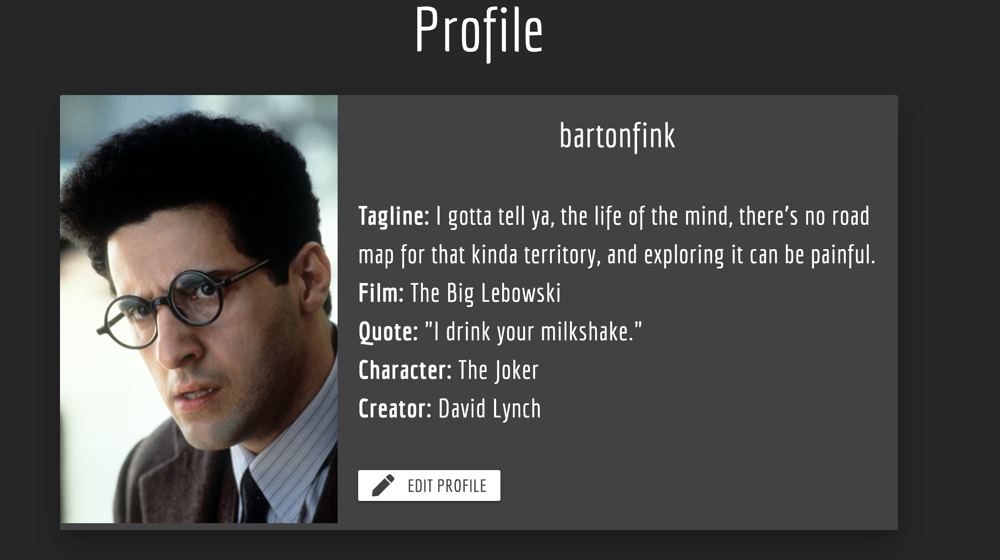</div>

#### - Palette -
While several elements differ from the original design, I intentionally avoided stating colour codes as Materialize has a range of pre-set colours. Setting the default font colour to white and the background to dark grey (#272727), I relied on materialize for the gold accent areas and utilised the contrasting greys for the cards.

<div align="center"></div>

<div align="center">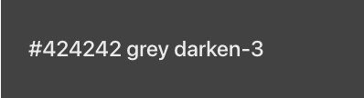</div>

<div align="center"></div>

<div align="center">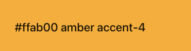</div>

I also used a range of additional colours for the range of buttons, ensuring a consistent colour key was used throughout. Within the main site, there are two buttons:
- Edit is white, since this is a neutral colour, and the act of editing is viewed as neutral from the site’s perspective
- Add is gold, both to attract users and to match the theme of the site, since this is the preferred action of the site
  
<div align="center">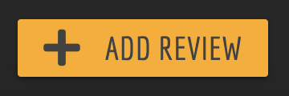</div>

<div align="center"></div>
	
Once within a form, there are three further options:
- Save is teal, again an attractive colour, since this is the goal of adding/editing reviews
- Cancel is grey, again being neutral in the site’s view
- Delete is red, in line with standards and as a warning for users, as this is least desired from the site’s perspective

<div align="center">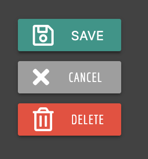</div>

#### - Typography -
The original proposed fonts were added at this stage. Economica was used throughout, with an adjustment for letter spacing to improve readability and a fall-back of the family sans serif. Satisfy was used only for the main headings, with a cursive family fall-back. I was apprehensive using Satisfy, since it is a brush script font and therefore more difficult to read. However, since the site doesn’t contain significant styling, since it breaks up the main heading from sub-headings where applicable and further separates the flash messages at the top of the screen, and since the site’s theme is art-related, I decided in favour of using it.

I used a range of font weights and sizes to distinguish between what is essentially a full site of bullet points varying in their importance. I also opted for a larger font size that absolutely required since both my fonts are slightly outside of the absolute norm.

<div align="center">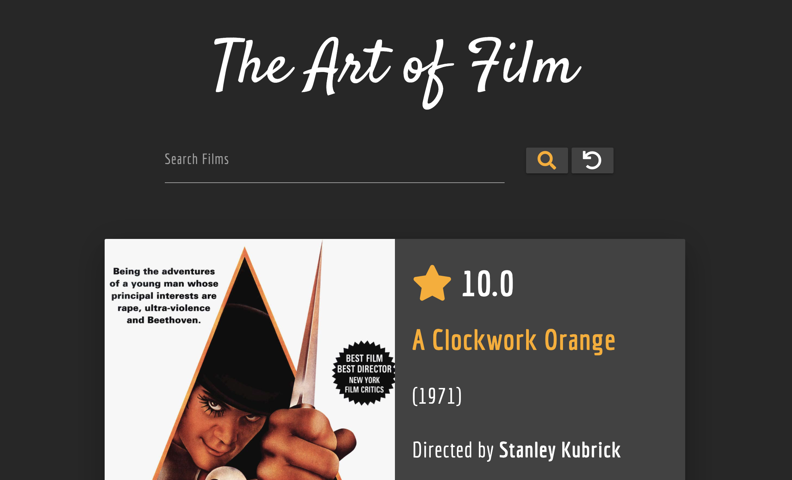</div>

#### - Imagery -
I decided to abandon the original logo and use text reading ‘A|F’ instead. I very much liked the way this looked, and it cut time on design when the priority is database management.

<div align="center"></div>

Images were used for films and profile pictures where appropriate and within the horizontal card layout from materialize, which helped save time on styling. All images are populated from the database and users can upload these via the add/edit film and edit profile forms. In addition, I added thumbnails to the reviews to break up the text, which are pre-populated from the film database.

<div align="center">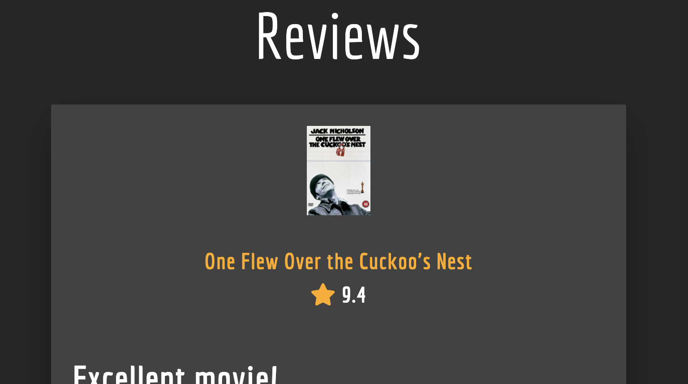</div>

Finally, Font Awesome icons were used where appropriate: the login/register forms, the buttons, and most importantly against the five metrics and the ultimate score.

<div align="center">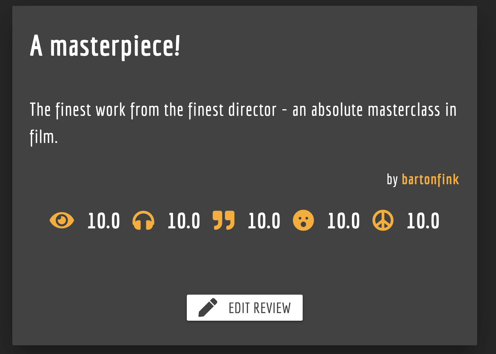</div>

#### - Streamlining CSS -
Once I was satisfied with how the site was looking, I ran through the classes and CSS and stripped as much out as I could, combining classes where possible or removing them entirely and leaning on Materialize’s in-built classes where appropriate.

## Phase IV: Responsiveness
The next phase of development was responsiveness; however, since the focus of the project is database management, I allocated time accordingly, leaving very little time for this phase.

When building out the site, I had consciously given myself several leg ups here. First, I made sure the site was relatively vertical (mobile-first!). Second, I made sure I’d already given cards and containers a responsive sizing using Materialize’s grid as I was building them, offsetting them where needed. Third, I’d used horizontal image cards, which Materialize sizes accordingly. Finally, I used font classes that were defined based on pre-defined root element size (rem), making them very easy to scale in one go. This meant making the site somewhat responsive took minutes.

(Note: I say ‘somewhat’ as I could have spent hours striving for perfection across every conceivable screen size, but this was not a priority on first developing the site)

For the above reasons, I decided to add two breakpoints, at 800px and 1200px. Using these, I sized my default text size (which I’d set to 20px) down to 16px for screens under 800px (the smallest recommended font size), and up to 24px for screens over 1200px. These two media queries essentially took care of the entire site since the components and containers were already sizing nicely.

## Phase V: Accessibility
Finally, amendments and additions were made to ensure accessibility for a range of viewing approaches.

The following accessibility considerations are based on the best ‘checklist’ I could find, designed by Aaron Cannon, a blind web developer and accessibility consultant. Aaron isn’t a fan of accessibility checklists, and I find the best work is often done by those critical of the current status quo. The checklist is in the credits section at the end.

### Mark-up
- Structure and presentation are separated, with zero in-line CSS used in the HTML document which can affect screen-readers
- The primary language (English) is outlined in the HTML head using the lang attribute
    - Note: the base template extends this for all child templates
- Proper mark-up has been used for each element type, such as sections, headings, paragraphs, etc.
- Headings are used in correct order without skipping any in the hierarchy and H1 is only used once
- The page titles are meaningful and accurate
    - Note: headings are added under sections as per convention, button hidden where their rendering was undesirable
- Skip to main has been implemented as per [this advice](https://accessibility.oit.ncsu.edu/it-accessibility-at-nc-state/developers/accessibility-handbook/mouse-and-keyboard-events/skip-to-main-content/) from NC State University
- HTML is in the proper readable order therefore tab index is not necessary throughout
    - [This article](https://www.a11yproject.com/posts/2021-01-28-how-to-use-the-tabindex-attribute/) helped clarify tab index here

### Visual Appearance and Content
- The website is still viewable and readable with images turned off as per chrome extension
- The website remains readable at 200% zoom
- All page elements can be tabbed to
- Headings and link text are all descriptive enough not to require additional tags
- The colours used in the design of the website meet the WCAG double A standard, with a contrast ratio of at least 4.6:1 (The majority of the site achieves the higher triple A standard with a ratio of over 10:1, however I wanted to offset the affiliate box at the bottom to draw attention to it, therefore I used Materialize’s slightly lighter shade of grey)

<div align="center">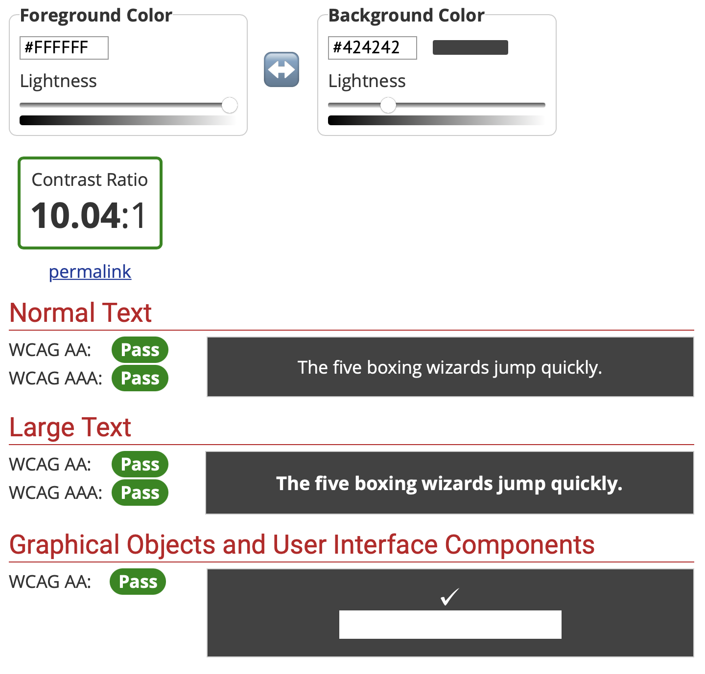</div>

<div align="center"></div>

- No content flashes or blinks more than three times per second
- The focus indicator is not hidden
- Colour is not used to convey meaning
    - Note: at this point, I added an animated underline that I found [here](https://tobiasahlin.com/blog/css-trick-animating-link-underlines/) to ensure link hovering was accessible, but I was slightly disappointed in the end result as the underline didn’t underline multi-line text, therefore I also added the grow on hover CSS from [hover.css](https://ianlunn.github.io/Hover/)

### Dynamic Content
- There is no dynamic content on the site

### Images and Multimedia
- All images have appropriate alt text
    - Note: I used Jinja for alt images–such as alt="Film image for {{ film.title }}"–to ensure alt text was correct, and while I am not certain all screen readers will pick this up accurately, if they don’t, the whole site will suffer the same issue
- There are no videos

### Forms
- There are no CAPTCHAs

## Technology Used
### Languages
- [HTML5](https://en.wikipedia.org/wiki/HTML5)
- [CSS3](https://en.wikipedia.org/wiki/CSS)
- [JavaScript](https://en.wikipedia.org/wiki/JavaScript)
- [Python3](https://www.python.org/download/releases/3.0/)
- [Jinja Templating](https://jinja.palletsprojects.com/en/3.0.x/)

### Databases, Frameworks, Libraries & Tools
- [MongoDB](https://www.mongodb.com) was the database management system used
- [Heroku](https://www.heroku.com) was used for hosting
- Flask, py-mongo and dnspython were all installed packages
- [Git](https://git-scm.com/) was used for version control
- [GitHub](https://github.com/) was used to host the repository and to deploy the website via GitHub pages
- [Gitpod](https://www.gitpod.io/) was used as a development area
- [Materialize](https://materializecss.com) was used for grid, components and additional styling
- [JQuery](https://jquery.com) was used to initialise Materialize components
- [Google fonts](https://fonts.google.com/) was used to import the fonts used
- [Font Awesome](https://fontawesome.com) was used for the icons
- [Canva](https://www.canva.com/en_gb/) was used to edit the logo used in design
- [Figma](https://www.figma.com/) was used to create the wireframes and mockups during the design process
- [MS Word](https://www.microsoft.com/en-gb/microsoft-365/word) was used to type this README before deployment
- [Chrome Dev Browser](https://google-chrome-dev.en.softonic.com/mac) was used for online access to the tools mentioned here.
- [Am I Responsive](http://ami.responsivedesign.is/#) was used for displaying the opening image.

          
---

# <div align="center">PART 3: POST-DEVELOPMENT</div>

- Testing & Fixes
    - Testing Code
    - Testing User Stories
    - Testing Features & Functionality
    - Bugs
- Limitations & Improvements
    - Current Limitations
    - Future Improvements
- Credits
    - Code
    - Copy
    - Media
    - Information
    - Acknowledgements

## Testing & Fixes

The website was tested from various angles: code, user perspectives, functionality, accessibility & responsiveness.

### Testing Code

I ran the code through the following code validators. This resulted in minor adjustments before repeating the process. Details are below.

- **[W3C Markup Validator]**([http://validator.w3.org](http://validator.w3.org)): minor errors, corrected
    - There were a couple of missing end </div> tags
        - Solution: added
    - I had used multiple dashes (‘--’) in the comments
        - Solution: used ‘==’ instead
    - There were spaces in the affiliate href’s
        - Solution: this is required for keyword searching
    - Note: all pages ran through except ‘members.html’ as this has security features preventing access

- **[W3C CSS Validator]**(https://jigsaw.w3.org/css-validator/): third party library/framework errors only
    - The validator returned a massive list of errors due to the Materialize framework and Font Awesome libraries, but there were no errors with manual CSS

- **[W3C Link Checker](**https://validator.w3.org/checklink): minor issues, corrected
    - Amazon doesn’t allow HTTP HEAD requests, therefore I checked the links manually and they all function
    - During my relentless streamlining of CSS I’d deleted the ‘content’ id that the ‘skip to main’ link pointed to
        - Solution: I re-added this tag

### Testing User Stories

The site’s **primary users** (and returning users alike) will want:

1. To understand what the site is about on first visit
- The title, The Art of Film, is presented clearly in a brush script, and there is a link to the About page offering more advice

2. To see an index of films alongside information about the artistic elements of each
- This is presented on the landing page, and each film has its own page providing more details

3. To create an account and user profile
- Users are clearly directed to login and register pages

4. To upload their views and rate films that are already on the site
- Once users are registered and logged in, they are presented with the options to add/edit films and reviews, as per the about page

5. To add films to the site to share with other users
- As above, the add film option is provided to registered members and the About page explains this

6. To find films related to their favourite films
- The user profile is the hub for finding similar films, as users can click on usernames and view other films users have added and reviewed, also explained on the About page

7. To find where to watch any of these films
- Each film on the index has a ‘Watch Now’ link that directs all users to a tailored Amazon page for that film

The **site owner** wants:

1. To invoke a deeper understanding and appreciate for the art dimension of film
- I believe this site fits the bill to achieve this

2. Earn affiliate revenue via links to streaming platforms
- The Amazon links are linked to my own affiliate account so I earn a commission on any purchases

### Testing Features & Functionality

I tested the functionality of the site by completing the following tests:

- I tried all links.
    - Off-site links open in a new browser
    - On-site navigation links work properly

- I tested the website on the three most-used browsers.
    - Safari
    - Chrome
    - FireFox

### Testing Accessibility & Responsiveness

- I tried this project on a range of screens:
    - An iPhone XS with a 5.8” screen
    - An iPad Pro with a 10.5” screen
    - A MacBook Pro with a 13” screen

### Bugs

#### - Fixed Bugs -

The following bugs arose and were resolved during development:

- Issues with films with zero reviews due to inability to calculate average scores
- Inability to display film title on review/film double loop due to nested loops not overlapping correctly

#### - Known Bugs -

The following bugs were not fully resolved:

- Button and anchors styled like buttons have slightly different formatting regarding size and text content, and styling these via manual CSS overwrites the Materialize styling that gives them form
    - Note: this is easily fixable with manual CSS but would have taken a little more time and wasn’t a priority

- The ‘word-spacing’ class causes alignment trouble regarding the metrics on the film.html and members.html pages, but everything is functional
    - Note: this has been removed, as this only made the element slightly better on Chrome/Firefox but made it look significantly worse on Safari

If you spot any further bugs – please [get in touch] ([mailto:trdownie@gmail.com](mailto:trdownie@gmail.com)).

## Limitations & Improvements

Limitations due to competence level or time constraints are outlined here, followed by suggested future improvements.

### Current Limitations

#### - Database Inefficiencies -

##### Reading and writing

There is a significant amount of reading and writing between the database and the app. This isn’t something I’m well-versed on, but it feels excessive. It also feels excessive that every time the film.html template is rendered it calculates the film’s score again via read and write functions. This is inefficient, but due to time constraints, a lack of experience, and the fact this is unlikely to see commercial use, this was not a priority on first development.

##### Duplicate data

Some data is duplicated; specifically, the ultimate score vales are saved alongside the metrics. There may be a more efficient way to do this, so that the averages are pulled using Jinja, but using Jinja for arithmetic felt excessive, so I left these within the documents.

#### - Login/Register Page -

Initially, I had planned to include the register and login forms on the same page to keep the site tidier and to avoid duplicated code within the register and login functions, however, this would have added a level of complexity to the view functions that I was not quite comfortable with yet. As such, I decided to create separate pages and functions.

#### - Missing Features -

Ideally, before commercial release, the site would have the option for users to change their password, and there should be some defensive programming to add a buffer between ‘delete’ buttons and the deletion of records, on profiles, films, and reviews.

### Future Improvements

#### - Expanded Film Info -

I would have liked to have included additional information for the films. Specifically, I would have liked to have had a fourth collection of actors that could be inserted via an autocomplete form input, and tags for genres, on the film documents, and descriptors, such as ‘exhilarating’ or ‘beautiful’, on the review documents.

Initially I added the chips and autocomplete inputs ready for these features, but I felt a solid foundation was the bigger priority, and I stuck within the ‘keep it simple’ mantra.

#### - Top/Bottom 5 Reviews -

Another feature I had really hoped to add was a ‘top 5’ and ‘bottom 5’ reviews section in each film. The plan was to store the top/bottom five reviews in the film document as nested objects, and each time a review was added, the function would determine if one of these needed replaced. In addition, all reviews would be held in the main reviews collection.

Then, on the film pages, users could view the top and bottom reviews automatically, and could click to expand and see more. Functionally, this wasn’t exceptionally complicated and would add significant depth to the site, but it would have taken timed I simply did not have.

#### - Upvote Reviews -

A different strategy would have been an option for users to upvote and downvote reviews, thereby rendering these on the film page either alongside the top/bottom five, or instead of these. To achieve this, I would have used an incremental index within the review documents and used the index to rank the reviews.

#### - Enhanced Rankings -

Another improvement I had on the horizon was expanding the rankings so that users could rank by any of the five metrics instead. Achieving this wasn’t clear to me, but would probably require a combination of JavaScript onclick events and Python working together to sort and render the films by a different metric.

#### - Movie Quotes -

Ideally, the movie quotes would be attributed and the attribution would like to the specific movie pages.

#### - Enhanced RegEx -

It would be a good idea to increase password security at some point via the requirement for special character, if the site ever became commercially active.

## Credits

### Code

All code was written entirely by the developer, except for code that was adapted from the following places:

- [Skip to main]([https://accessibility.oit.ncsu.edu/it-accessibility-at-nc-state/developers/accessibility-handbook/mouse-and-keyboard-events/skip-to-main-content/](https://accessibility.oit.ncsu.edu/it-accessibility-at-nc-state/developers/accessibility-handbook/mouse-and-keyboard-events/skip-to-main-content/))
- [Grow on hover]([https://ianlunn.github.io/Hover/](https://ianlunn.github.io/Hover/))
- [Underline animation on hover]([https://tobiasahlin.com/blog/css-trick-animating-link-underlines/](https://tobiasahlin.com/blog/css-trick-animating-link-underlines/))

### Copy

All copy was written by the developer, except for the film quotes sprinkled throughout.

### Media

All images are hosted by image owners and were found using Google.

No permissions have been given for the use of these images, and all images are shots from movies or promotional posters. As per UK copyright laws, these are lesser versions than the originals and are used to add context and not simply for decorative purposes.

### Information

I consulted a range of informational sources to complete this project. They are listed here:

- [Data modelling best practices]([https://www.mongodb.com/blog/post/performance-best-practices-mongodb-data-modeling-and-memory-sizing](https://www.mongodb.com/blog/post/performance-best-practices-mongodb-data-modeling-and-memory-sizing))

- [Information on embedded documents]([https://docs.mongodb.com/manual/tutorial/model-embedded-one-to-one-relationships-between-documents/#std-label-data-modeling-example-one-to-one](https://docs.mongodb.com/manual/tutorial/model-embedded-one-to-one-relationships-between-documents/#std-label-data-modeling-example-one-to-one))

- Multiple pages within the [MongoDB documentation]([https://docs.mongodb.com/manual/reference/method/db.collection.find/#mongodb-method-db.collection.find](https://docs.mongodb.com/manual/reference/method/db.collection.find/#mongodb-method-db.collection.find))

- [HTML line length guidance](https://stackoverflow.com/questions/2886603/is-there-a-recommended-maximum-line-length-for-html-or-javascript/33758289))

- Python's [PEP 8 Style Guide](https://www.python.org/dev/peps/pep-0008/#blank-lines)

- Aaron Cannon for [The Accessibility Checklist I Vowed I’d Never Write]([http://northtemple.com/1608/](http://northtemple.com/1608/))

### Acknowledgements

I would like to thank:

- [Code Institute](https://codeinstitute.net/) for the material

- My family and those around me who put up with 72-hour plus reply times to messages when I’m deep into the syntax, both code and conventional.

- The countless people before me who’ve iteratively built human civilisation to this point. We live in exciting times and I’m eternally grateful for that fact.
